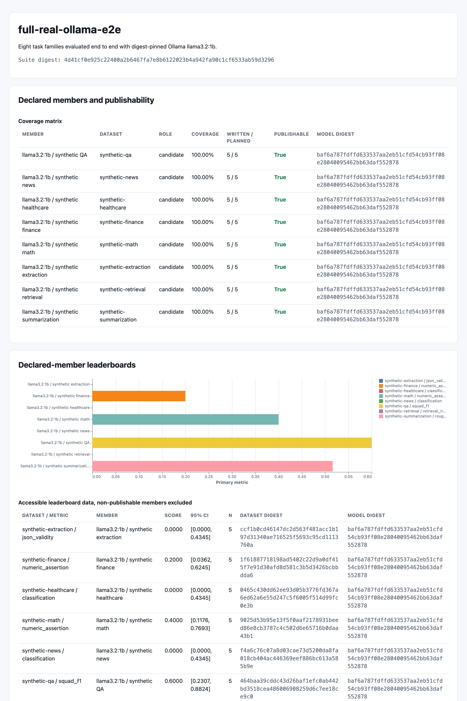
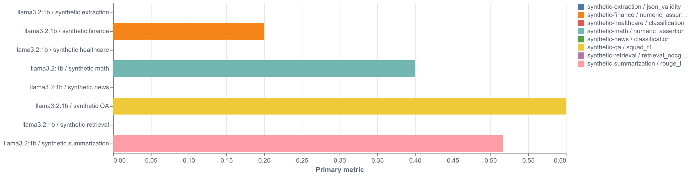
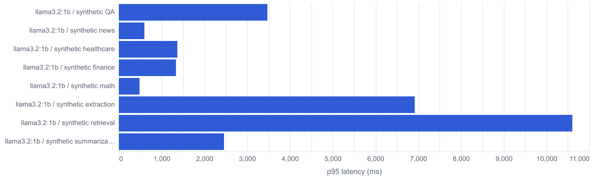
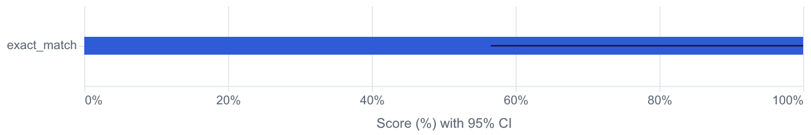
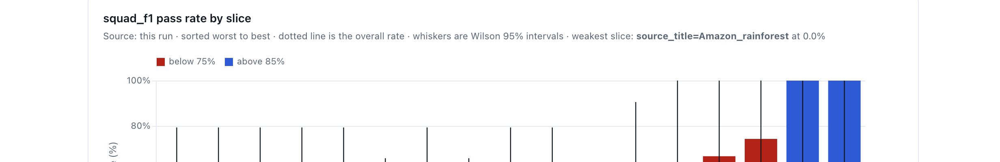
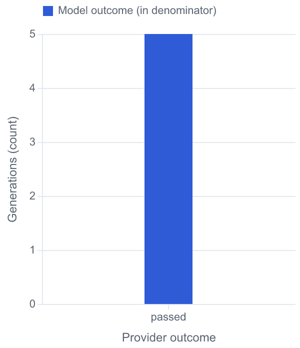
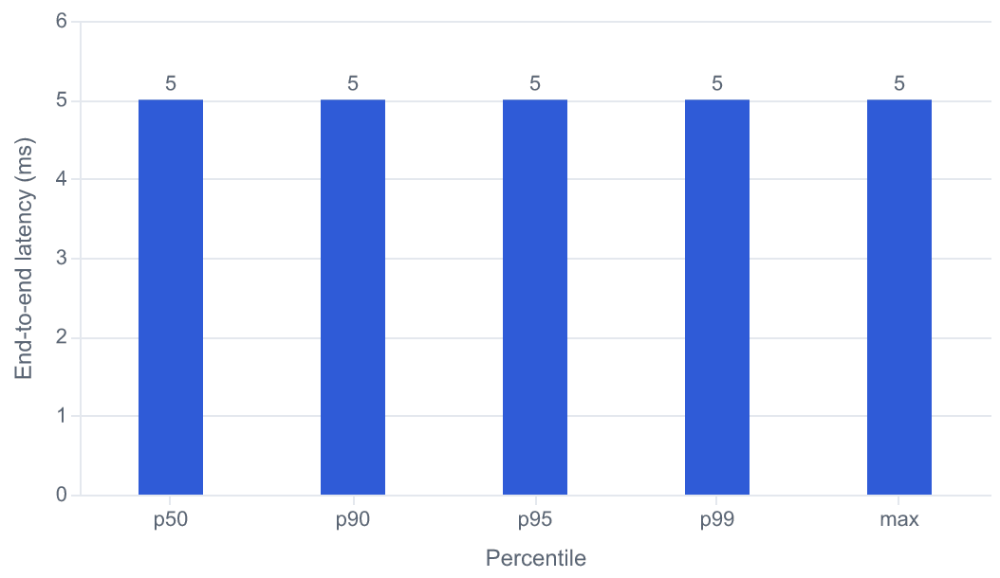
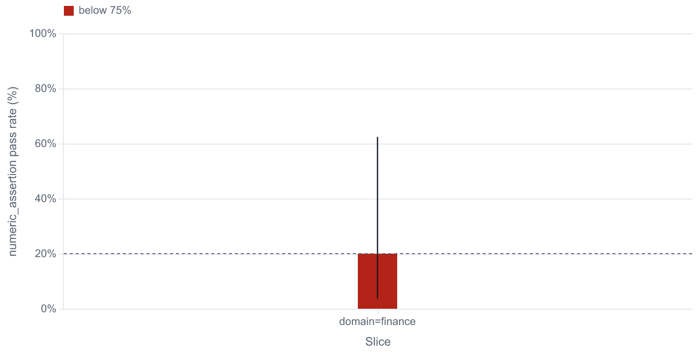

# evalanche

Reproducible, resumable LLM evaluation harness. The **`evalctl`** CLI validates datasets, runs digest‑pinned evaluations, stores **immutable** generations in PostgreSQL, rescores them through a **versioned metric catalog**, aggregates many runs into a suite dashboard, and emits statistically honest **JSON / HTML / JUnit** reports.

> **The load‑bearing idea:** generation and scoring are separate, independently versioned stages joined by a durable store. *You generate once; you score many times.* Re‑scoring historical outputs costs zero inference dollars.

The installable package is **evalanche**; the Python import path is `evalharness`; the CLI is `evalctl`.

## What it is

A harness for measuring LLM output quality in a way you can trust, reproduce, and defend. Every run is pinned to a dataset digest and a model revision, so a number you report today can be reproduced byte‑for‑byte tomorrow. Generations are written once and never mutated; scoring is a separate, versioned pass over that immutable record. That separation is what makes rescoring free and comparisons honest.

It is built for engineers who need to answer "did this change actually help, and can I prove it?" without paying for inference every time they move a threshold or add a metric.

## What it offers

**Data plane.** Dataset validation with schema, license, and pin enforcement before a run touches a model; deterministic, content‑addressed dataset materialization from adapters; and a holdout guard that keeps calibration data out of scored runs.

**Providers and runtime.** Ollama, OpenAI‑compatible (revision‑pinned), and Mock backends behind one protocol, wrapped in a managed runtime with RPM/TPM token buckets, bounded concurrency, and a circuit breaker. The executor is resumable, with bounded retries, a response cache, and three layers of timeouts.

**Scoring and statistics.** A versioned metric catalog spanning lexical, structured, classification, retrieval, and overlap families; per‑slice rollups (`dimension=value` beside `__overall__`); and honest statistics (Wilson, BCa, paired bootstrap, McNemar, Benjamini‑Hochberg, Cohen's h, pass@k, power). Re‑scoring stored generations with new metrics costs zero inference.

**Reporting and suites.** Self‑contained JSON, HTML, and JUnit reports per run; paired baseline‑vs‑candidate comparison with confidence intervals; and multi‑run suite aggregation into a leaderboard, slice, and latency dashboard built purely from report artifacts.

**Optional quality signals.** LLM‑as‑judge (rubric and pairwise) and RAG evidence (faithfulness / NLI). Both are **informational by default** and only influence a gating decision once a calibration is validated against a holdout and explicitly attached, so an uncalibrated judge can never silently pass or fail a release.

**Observability.** Rich progress, structured logs, privacy‑safe payload lineage, and OTLP tracing across the pipeline.

## How scoring works

The score path is the core of the harness. It runs in distinct, independently versioned stages joined by the durable store:

1. **Validate.** The dataset is checked against its schema, license allow‑list, and pins. A dataset digest is computed so the exact inputs are recoverable later.
2. **Generate once.** The executor renders each case through the pinned model revision and writes one **immutable** `Generation` row per case to PostgreSQL. Retries, cache hits, and finish reasons are recorded; nothing is overwritten.
3. **Score.** The metric catalog computes a per‑case score for every stored generation. The scoring engine rolls those up per slice and for `__overall__`, attaching a confidence interval to each aggregate rather than a bare point estimate.
4. **Report.** A schema‑2.1 report is emitted as JSON, a self‑contained HTML dashboard, and JUnit, with coverage and a publishable/blocked verdict.
5. **Rescore and compare (zero inference).** Because generations are immutable, you can re‑score them under a different metric set for $0, and compare two runs with a paired test that reports a delta and its confidence interval.
6. **Aggregate.** Many report artifacts fold into a suite dashboard that ranks runs and surfaces per‑slice and latency differences.

Harness failures (a provider timing out, garbage output) are counted separately from model failures and excluded from the quality denominator, so an infrastructure blip never silently deflates a score.

## What the reports look like

Every run emits a self‑contained HTML dashboard (Altair / Vega‑Lite, no CDN). Open the committed artifacts in a browser, or see the rendered pages below.

### Single‑run dashboard

From the offline PoC in [`fixtures/poc/report.html`](fixtures/poc/report.html): publishability gates, KPIs, evaluation context, sampled cases, then quality / reliability / latency charts.


### Suite dashboard

`evalctl suite build` folds many report artifacts into one leaderboard. This page is eight live Ollama runs across QA, news, healthcare, finance, math, extraction, retrieval, and summarization (coverage matrix, primary‑metric chart, and accessible tables):



Chart close‑ups from the same suite (primary metric and p95 latency):





### Single‑run chart detail

From the same PoC run: metric scores with 95% confidence intervals, pass rate by slice, outcomes, and latency percentiles:









### Industry example (finance)

A live finance pack scored with `numeric_assertion`, sliced by domain:



## How it is used

The core loop is: **validate a dataset → generate once → score / rescore → report → aggregate into a suite**.

### Requirements

- Python 3.12+
- [uv](https://github.com/astral-sh/uv)
- Docker (PostgreSQL via Compose; Ollama optional for live runs)

### Quick start

```bash
docker compose up -d postgres
uv sync --all-extras
cp .env.example .env

uv run alembic upgrade head          # Alembic owns the schema (head: 0003)

# Validate the sample dataset
uv run evalctl dataset-validate fixtures/sample_dataset

# Offline proof of concept (no GPU / Ollama) — regenerates fixtures/poc/
uv run python scripts/run_poc.py
uv run pytest tests/test_poc.py -q
```

### Live run

```bash
docker compose up -d ollama
ollama pull llama3.2:1b
uv run evalctl run \
  --dataset fixtures/sample_dataset \
  --template fixtures/templates/qa.jinja \
  --model llama3.2:1b \
  --provider ollama \
  --concurrency 2
```

### Rescore & compare (zero inference)

```bash
uv run evalctl runs rescore <run_id> --metrics exact_match,squad_f1,rouge_l
uv run evalctl runs compare <baseline_run_id> <candidate_run_id> \
  --metric exact_match --allow-compatible
```

### Aggregate runs into a suite

```bash
uv run evalctl suite validate suite.yaml
uv run evalctl suite build suite.yaml --output-dir suite-output
# → suite-output/suite.json + self-contained suite.html leaderboard
```

### Judge and RAG evidence (informational until calibrated)

```bash
# Rubric / pairwise judgments over a run's generations
uv run evalctl judge run --report <report.json> --provider mock --output judgment.json

# Prove a judge agrees with a holdout, then attach it so it can gate
uv run evalctl judge validate judgment.json --calibration calibration.json
uv run evalctl judge attach-calibration judgment.json --calibration calibration.json

# Faithfulness / NLI evidence for retrieval-augmented answers
uv run evalctl rag evidence --report <report.json> --nli-provider mock --output rag_evidence.json
```

See [docs/guide.md §4](docs/guide.md#4-cli-command-reference--end-to-end-workflows) for the full CLI reference and an end‑to‑end baseline‑vs‑candidate workflow.

## Design guarantees

What the harness enforces today:

- **Reproducibility.** Dataset digests and pinned model revisions make any reported number recoverable and re‑runnable byte‑for‑byte.
- **Durable, immutable store.** Generations are written once to PostgreSQL and never mutated; the schema is owned by Alembic migrations (head `0003`), so upgrades are ordered and reversible.
- **Reliability under load.** Bounded concurrency, RPM/TPM rate limiting, a circuit breaker, bounded retries, and three‑layer timeouts keep a slow or flapping provider from stalling or corrupting a run. Runs resume from the store rather than restarting.
- **Statistical honesty.** Aggregates carry confidence intervals, comparisons use paired tests, and harness failures are excluded from the quality denominator instead of silently counted as passes.
- **Security baseline.** Parameterized queries throughout, license and pin enforcement at the dataset boundary, a holdout guard against calibration leakage, and self‑contained reports that make no outbound network calls.
- **Observability.** Structured logs at decision points, privacy‑safe payload lineage, and OTLP tracing across the pipeline.
- **Gated‑by‑default quality signals.** LLM‑as‑judge and RAG evidence stay informational until a calibration is validated against a holdout and explicitly attached, so they cannot gate a release before they are trusted.

## Documentation

New here? Read [**`docs/guide.md`**](docs/guide.md) — the end‑to‑end engineer onboarding & operations guide. For a role‑based reading order and the full index, see [**`docs/README.md`**](docs/README.md).

| Doc | Purpose |
|-----|---------|
| [docs/guide.md](docs/guide.md) | Deep onboarding: mental model, CLI, schema, metrics, logs, runbook |
| [docs/architecture.md](docs/architecture.md) | Components, seams, and where‑to‑find‑what module map |
| [docs/dataplane.md](docs/dataplane.md) | Case → generate → score → report; timeouts, retries, coverage |
| [docs/schema.md](docs/schema.md) | PostgreSQL model + Alembic `0003` |
| [docs/metrics.md](docs/metrics.md) | Metric catalog narrative: what each metric is for and how they compose |
| [docs/datasets.md](docs/datasets.md) | Dataset fixtures, adapters, licensing, and materialization |
| [docs/providers.md](docs/providers.md) | Provider protocol, adapters, limiter/breaker, adding a backend |
| [docs/reports.md](docs/reports.md) | Report artifacts and audience views |
| [docs/operations.md](docs/operations.md) | Local ops, CLI recipes, failure modes, PoC |
| [docs/principles.md](docs/principles.md) | Non‑negotiables that shape every change |
| [docs/benchmarks.md](docs/benchmarks.md) | Performance gates |

## Proof of concept

Committed artifacts in [`fixtures/poc/`](fixtures/poc/) prove the full data plane in CI without pulling models:

- `report.json` / `report.html` — full report from a fixed mock run
- `meta.json` — run id, digest, pass rate, coverage

See [docs/operations.md](docs/operations.md#proof-of-concept).

## Non‑goals

- Not a training or fine‑tuning pipeline
- Not a prompt optimizer
- Not a real‑time production guardrail
- Not a replacement for human review on high‑stakes decisions

## Development

```bash
uv run ruff check .
uv run mypy src/evalharness
uv run pytest -q
```

## License

MIT
