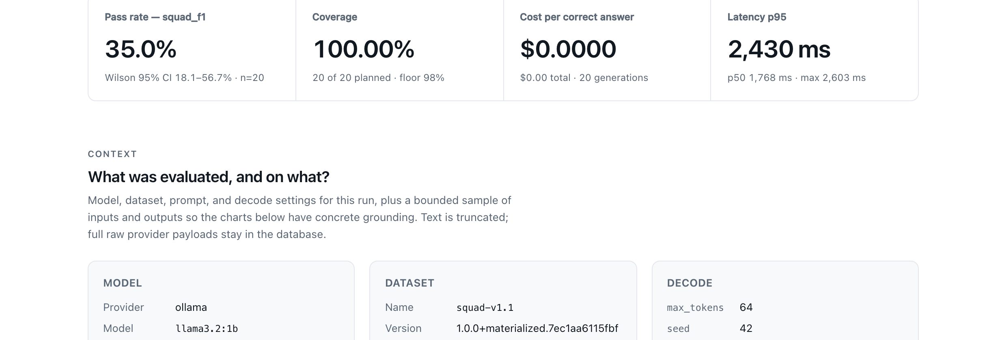
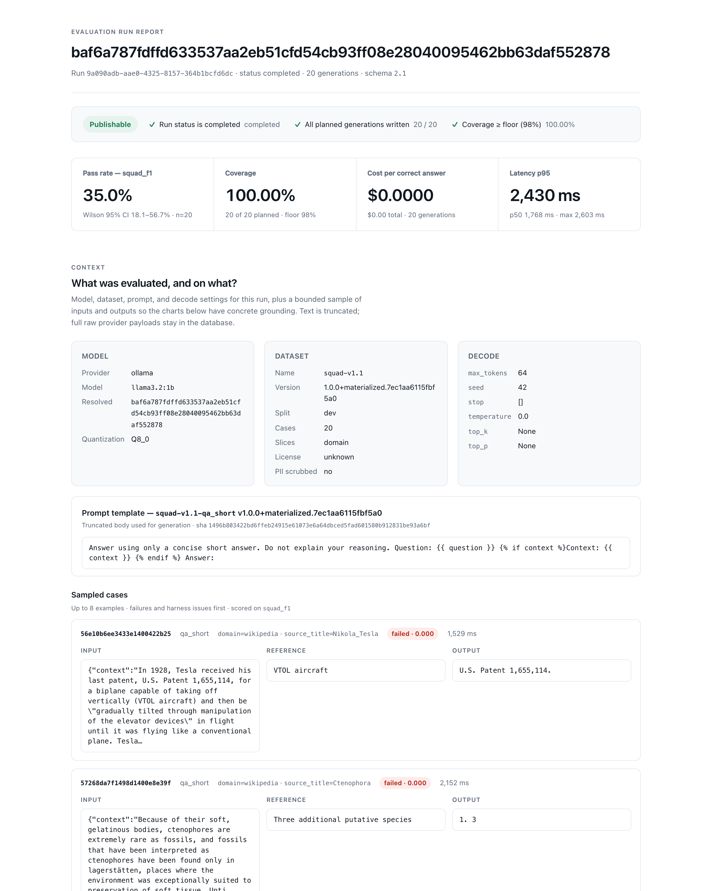
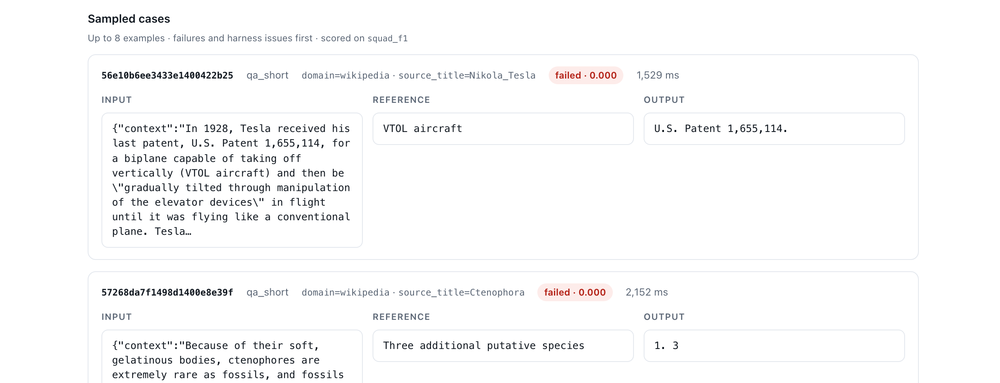
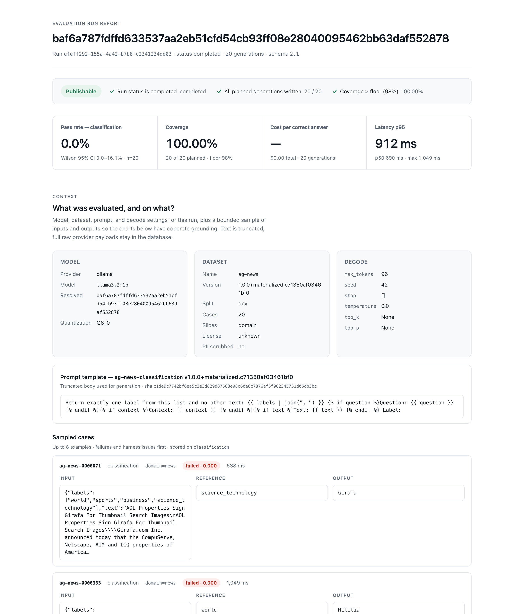
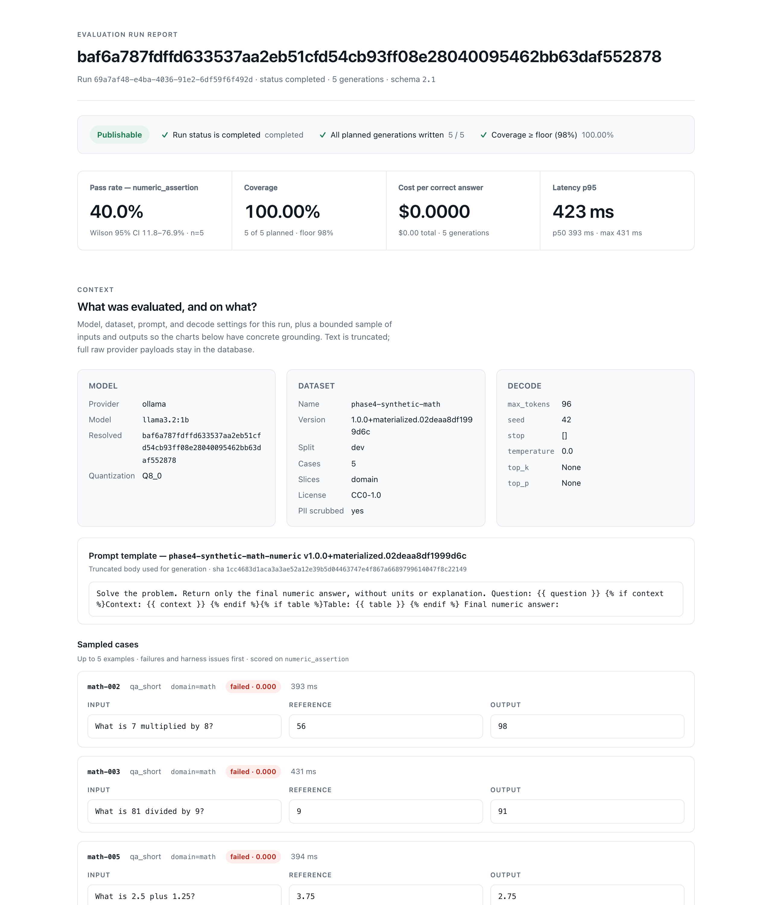
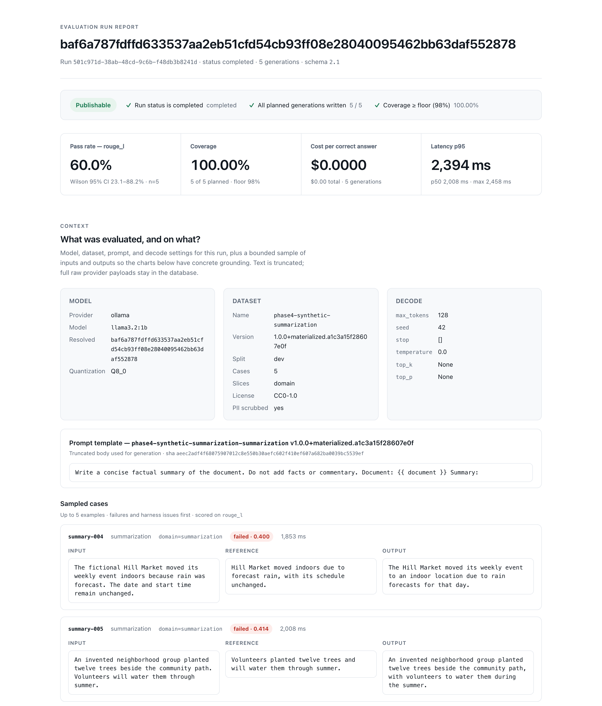
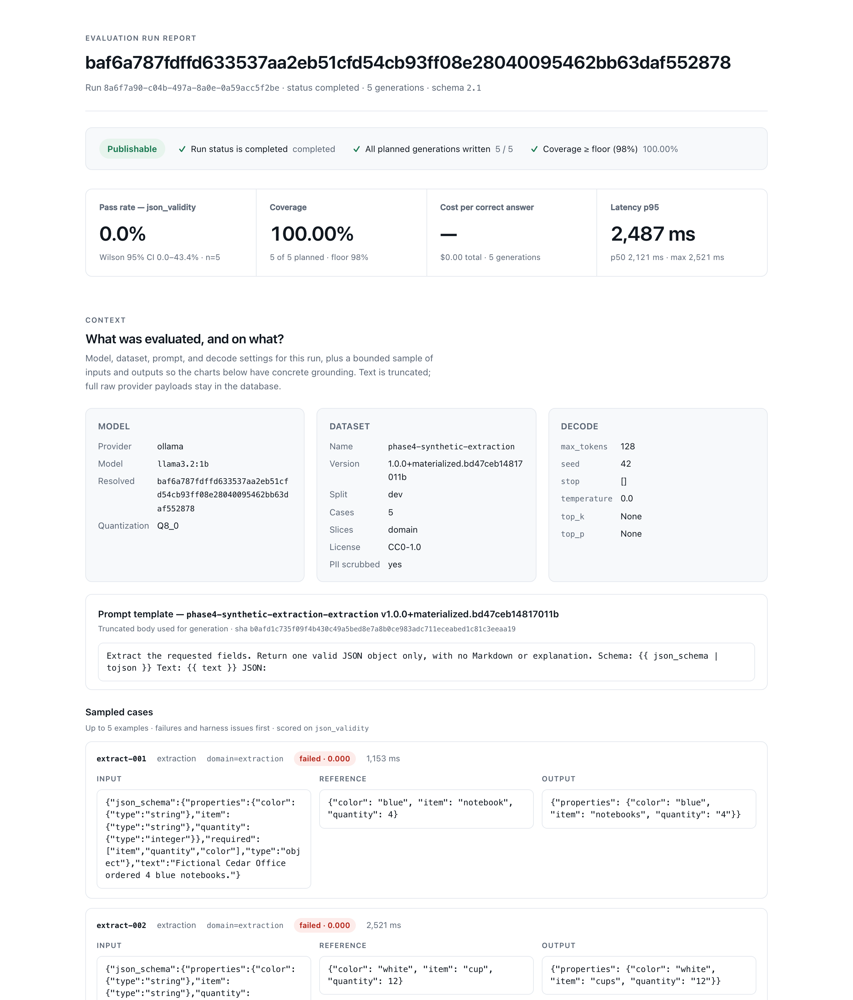
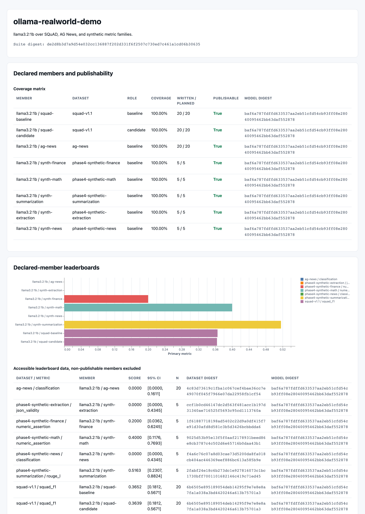
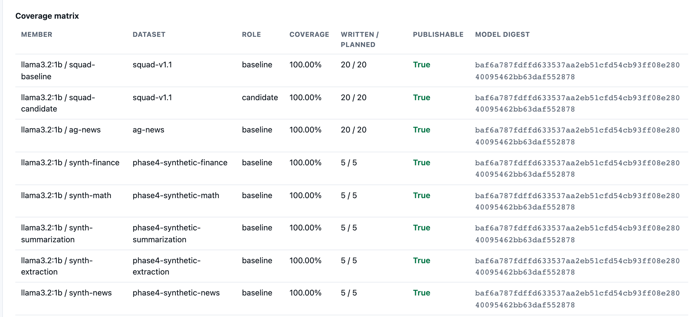

# evalanche

Reproducible, resumable LLM evaluation harness. The **`evalctl`** CLI validates datasets, runs digest‑pinned evaluations, stores **immutable** generations in PostgreSQL, rescores them through a **versioned metric catalog**, aggregates many runs into a suite dashboard, and emits statistically honest **JSON / HTML / JUnit** reports.

> **The load‑bearing idea:** generation and scoring are separate, independently versioned stages joined by a durable store. *You generate once; you score many times.* Re‑scoring historical outputs costs zero inference dollars.

The installable package is **evalanche**; the Python import path is `evalharness`; the CLI is `evalctl`.

## What it is

A harness for measuring LLM output quality in a way you can trust, reproduce, and defend. Every run is pinned to a dataset digest and a model revision, so a number you report today can be reproduced byte‑for‑byte tomorrow. Generations are written once and never mutated; scoring is a separate, versioned pass over that immutable record. That separation is what makes rescoring free and comparisons honest.

It is built for engineers who need to answer "did this change actually help, and can I prove it?" without paying for inference every time they move a threshold or add a metric.

## What it offers

**Data plane.** Dataset validation with schema, license, and pin enforcement before a run touches a model; deterministic, content‑addressed dataset materialization from adapters; and a holdout guard that keeps calibration data out of scored runs.

**Providers and runtime.** Ollama, OpenAI‑compatible (revision‑pinned), and Mock backends behind one protocol, wrapped in a managed runtime with RPM/TPM token buckets, bounded concurrency, and a circuit breaker. The executor is resumable, with bounded retries, a response cache, and three layers of timeouts.

**Scoring and statistics.** A versioned metric catalog spanning lexical, structured, classification, retrieval, and overlap families; per‑slice rollups (`dimension=value` beside `__overall__`); and honest statistics (Wilson, BCa, paired bootstrap, McNemar, Benjamini‑Hochberg, Cohen's h, pass@k, power). Re‑scoring stored generations with new metrics costs zero inference.

**Reporting and suites.** Self‑contained JSON, HTML, and JUnit reports per run; paired baseline‑vs‑candidate comparison with confidence intervals; and multi‑run suite aggregation into a leaderboard, slice, and latency dashboard built purely from report artifacts.

**Optional quality signals.** LLM‑as‑judge (rubric and pairwise) and RAG evidence (faithfulness / NLI). Both are **informational by default** and only influence a gating decision once a calibration is validated against a holdout and explicitly attached, so an uncalibrated judge can never silently pass or fail a release.

**Observability.** Rich progress, structured logs, privacy‑safe payload lineage, and OTLP tracing across the pipeline.

## How scoring works

The score path is the core of the harness. It runs in distinct, independently versioned stages joined by the durable store:

1. **Validate.** The dataset is checked against its schema, license allow‑list, and pins. A dataset digest is computed so the exact inputs are recoverable later.
2. **Generate once.** The executor renders each case through the pinned model revision and writes one **immutable** `Generation` row per case to PostgreSQL. Retries, cache hits, and finish reasons are recorded; nothing is overwritten.
3. **Score.** The metric catalog computes a per‑case score for every stored generation. The scoring engine rolls those up per slice and for `__overall__`, attaching a confidence interval to each aggregate rather than a bare point estimate.
4. **Report.** A schema‑2.1 report is emitted as JSON, a self‑contained HTML dashboard, and JUnit, with coverage and a publishable/blocked verdict.
5. **Rescore and compare (zero inference).** Because generations are immutable, you can re‑score them under a different metric set for $0, and compare two runs with a paired test that reports a delta and its confidence interval.
6. **Aggregate.** Many report artifacts fold into a suite dashboard that ranks runs and surfaces per‑slice and latency differences.

Harness failures (a provider timing out, garbage output) are counted separately from model failures and excluded from the quality denominator, so an infrastructure blip never silently deflates a score.

## What the reports look like

Screenshots below come from a **full Ollama end-to-end pass** (`llama3.2:1b`) over
cache-only **SQuAD v1.1** and **AG News** packs plus synthetic fixtures that
exercise other metric families. Artifacts live under `reports/demo/ollama/`
(gitignored). Reproduce with Postgres + Ollama up, then:

```bash
docker compose up -d postgres ollama
ollama pull llama3.2:1b
./scripts/demo_realworld.sh --provider ollama --model llama3.2:1b
```

Numbers cited are from that run (small smoke packs, 1B model). They illustrate
how to read the UI, not a claim about SOTA quality.

### Publishability and KPIs



**How to read it.** The green badges are harness honesty gates, not model
quality: run completed, all planned generations written, coverage at or above
the floor (here 98%). **Pass rate** is the fraction of scored cases that pass
the primary metric, with a **Wilson 95% CI**. Wide intervals on small `n` are
expected. Coverage near 100% with a low pass rate means the pipeline worked and
the model simply scored poorly (or the metric is strict). Cost stays honest
when the provider reports pricing; unpriced generations fail closed on money
gates elsewhere.

### Extractive QA (`squad_f1`, `exact_match`)

SQuAD v1.1 smoke pack (20 cases). Primary metric `squad_f1` pass rate **35%**
(Wilson 95% CI about 18–57%). Exact match was harder on this 1B model: F1 can
credit partial token overlap while EM requires a normalized string match.




**How to read it.** Each bar is a metric×slice (or overall) point estimate with
an error bar for the CI method labeled on the report (Wilson for rates). Compare
metrics on the same cases: if `squad_f1` rises while `exact_match` stays flat,
the model is getting closer without hitting exact strings. Do not treat the CI
midpoint as a leaderboard score without `n`.



**How to read it.** Sampled cases are for debugging, not the denominator. Check
whether failures are empty answers, verbose answers that hurt EM, or wrong
spans. Latency per case sits beside the score so slow outliers are visible.

### Classification (`classification`)

AG News smoke (20 cases) with constrained label output. On `llama3.2:1b` this
pass rate was **0%** (CI up to ~16%): the small model often fails to emit an
exact allow-listed label even when the topic is clear.



**How to read it.** Classification here is fail-closed on the label set: near
misses and free-form prose count as wrong. Low pass rate with high coverage
points to prompt or model capability, not a broken runner. Slice charts (when
present) show whether one domain drives the miss rate.

### Numeric assertion (`numeric_assertion`)

Synthetic finance and math packs (final number only). Observed pass rates on
this run: finance **20%**, math **40%** (wide CIs at `n=5`).




**How to read it.** The metric extracts a final numeric answer and compares it
to the reference. Extra prose usually fails. Use these packs to verify that
decode limits and prompts keep the model in "number only" mode before you trust
a larger finance corpus.

### Summarization overlap (`rouge_l`, `chrf_pp`)

Synthetic summarization smoke. Primary `rouge_l` pass rate **60%** on this run
(CI roughly 23–88% at `n=5`).



**How to read it.** ROUGE/chrF are overlap metrics, not factuality judges. A
high score can still hallucinate; a low score can still be faithful but
paraphrased. Pair them with RAG/judge signals when truthfulness matters.

### Structured extraction (`json_validity`, `json_field_f1`)

Synthetic extraction smoke. Primary `json_validity` was **0%** here: the 1B
model did not reliably emit parseable JSON under the constrained template.



**How to read it.** `json_validity` is a gate on well-formed JSON; field F1
scores content only after parse succeeds. Zero validity means field F1 never
gets a fair shot. Fix schema prompting or use a stronger model before tuning
field-level scores.

### Slices and reliability


**How to read it.** Bars are pass rate within a slice key (for SQuAD, often
`domain` / `source_title`). A flat low chart means uniform weakness; a few tall
bars mean the headline number hides concentration in easy slices.


**How to read it.** Reliability separates **model** outcomes from **harness**
failures (timeouts, provider errors). Harness failures are excluded from the
quality denominator so infra blips do not look like worse accuracy.

### Latency and cost


**How to read it.** Prefer p50/p95/p99 over the mean. On this Ollama SQuAD
smoke, p95 was about **2.4 s** per generation. Spikes at p99/max flag tail
latency under concurrency. Cost KPIs stay blank or zero when the provider does
not report price; that is intentional honesty, not "free."

### Suite rollup (multi-metric leaderboard)

`evalctl suite build` folds the Ollama members (SQuAD, AG News, finance, math,
summarization, extraction, and related synthetics) into one offline HTML suite:






**How to read it.** The coverage matrix answers "did every member finish
honestly?" The primary-metric chart compares different tasks on their own
metrics (do not average `squad_f1` with `rouge_l`). Latency by member shows
which packs dominate wall time. Paired compares (when declared) carry deltas
and CIs for baseline vs candidate on the **same** cases.

### Surfaces exercised (Ollama)

| Surface | Result in this demo |
|---------|---------------------|
| `dataset materialize` / `validate` | SQuAD + AG News smoke packs from pinned snapshots |
| `run` (`--provider ollama`) | Non-zero `squad_f1`, `numeric_assertion`, `rouge_l`; strict label/JSON still hard for 1B |
| `runs rescore` | Zero-inference rescore of SQuAD |
| `runs compare` | Baseline `temperature=0` vs candidate `temperature=0.2` on SQuAD |
| `suite validate` / `build` | Eight-member suite HTML/JSON |

Judge / RAG can use the same Ollama endpoint; gates / matrix CLIs are not on the
default `evalctl` entry in this checkout.

## How it is used

The core loop is: **validate a dataset → generate once → score / rescore → report → aggregate into a suite**.

### Requirements

- Python 3.12+
- [uv](https://github.com/astral-sh/uv)
- Docker (PostgreSQL via Compose; Ollama optional for live runs)

### Quick start

```bash
docker compose up -d postgres
uv sync --all-extras                 # workspace + extras (includes [datasets])
cp .env.example .env

uv run alembic upgrade head          # Alembic owns the schema (head: 0003)

# Validate the sample dataset
uv run evalctl dataset-validate fixtures/sample_dataset

# Offline proof of concept (no GPU / Ollama) — regenerates fixtures/poc/
uv run python scripts/run_poc.py
uv run pytest tests/test_poc.py -q
```

This repo is a uv workspace: root package **evalanche** (`evalharness`) plus
optional **evaldatasets** under `packages/evaldatasets`. Harness-only:
`uv sync --package evalanche`. Materialize needs
`uv sync --extra datasets` (or `evalanche[datasets]`). See
[docs/datasets.md](docs/datasets.md).

### Live run

```bash
docker compose up -d ollama
ollama pull llama3.2:1b
uv run evalctl run \
  --dataset fixtures/sample_dataset \
  --template fixtures/templates/qa.jinja \
  --model llama3.2:1b \
  --provider ollama \
  --concurrency 2
```

### Rescore & compare (zero inference)

```bash
uv run evalctl runs rescore <run_id> --metrics exact_match,squad_f1,rouge_l
uv run evalctl runs compare <baseline_run_id> <candidate_run_id> \
  --metric exact_match --allow-compatible
```

### Aggregate runs into a suite

```bash
uv run evalctl suite validate suite.yaml
uv run evalctl suite build --manifest suite.yaml --output suite-output
# → suite-output/suite.json + self-contained suite.html leaderboard
```

### Real-world cache-only packs (SQuAD + AG News)

```bash
chmod +x scripts/demo_realworld.sh
docker compose up -d postgres ollama && ollama pull llama3.2:1b
./scripts/demo_realworld.sh --provider ollama --model llama3.2:1b
# snapshots + pins under .cache/datasets/ (gitignored)
# packs under .cache/packs/; HTML/JSON under reports/demo/ollama/
```

### Judge and RAG evidence (informational until calibrated)

```bash
# Rubric / pairwise judgments over a run's generations
uv run evalctl judge run --report <report.json> --provider mock --output judgment.json

# Prove a judge agrees with a holdout, then attach it so it can gate
uv run evalctl judge validate judgment.json --calibration calibration.json
uv run evalctl judge attach-calibration judgment.json --calibration calibration.json

# Faithfulness / NLI evidence for retrieval-augmented answers
uv run evalctl rag evidence --report <report.json> --nli-provider mock --output rag_evidence.json
```

See [docs/guide.md §4](docs/guide.md#4-cli-command-reference--end-to-end-workflows) for the full CLI reference and an end‑to‑end baseline‑vs‑candidate workflow.

## Design guarantees

What the harness enforces today:

- **Reproducibility.** Dataset digests and pinned model revisions make any reported number recoverable and re‑runnable byte‑for‑byte.
- **Durable, immutable store.** Generations are written once to PostgreSQL and never mutated; the schema is owned by Alembic migrations (head `0003`), so upgrades are ordered and reversible.
- **Reliability under load.** Bounded concurrency, RPM/TPM rate limiting, a circuit breaker, bounded retries, and three‑layer timeouts keep a slow or flapping provider from stalling or corrupting a run. Runs resume from the store rather than restarting.
- **Statistical honesty.** Aggregates carry confidence intervals, comparisons use paired tests, and harness failures are excluded from the quality denominator instead of silently counted as passes.
- **Security baseline.** Parameterized queries throughout, license and pin enforcement at the dataset boundary, a holdout guard against calibration leakage, and self‑contained reports that make no outbound network calls.
- **Observability.** Structured logs at decision points, privacy‑safe payload lineage, and OTLP tracing across the pipeline.
- **Gated‑by‑default quality signals.** LLM‑as‑judge and RAG evidence stay informational until a calibration is validated against a holdout and explicitly attached, so they cannot gate a release before they are trusted.

## Documentation

New here? Read [**`docs/guide.md`**](docs/guide.md) — the end‑to‑end engineer onboarding & operations guide. For a role‑based reading order and the full index, see [**`docs/README.md`**](docs/README.md).

| Doc | Purpose |
|-----|---------|
| [docs/guide.md](docs/guide.md) | Deep onboarding: mental model, CLI, schema, metrics, logs, runbook |
| [docs/architecture.md](docs/architecture.md) | Components, seams, and where‑to‑find‑what module map |
| [docs/dataplane.md](docs/dataplane.md) | Case → generate → score → report; timeouts, retries, coverage |
| [docs/schema.md](docs/schema.md) | PostgreSQL model + Alembic `0003` |
| [docs/metrics.md](docs/metrics.md) | Metric catalog narrative: what each metric is for and how they compose |
| [docs/datasets.md](docs/datasets.md) | Dataset fixtures, adapters, licensing, and materialization |
| [docs/providers.md](docs/providers.md) | Provider protocol, adapters, limiter/breaker, adding a backend |
| [docs/reports.md](docs/reports.md) | Report artifacts and audience views |
| [docs/operations.md](docs/operations.md) | Local ops, CLI recipes, failure modes, PoC |
| [docs/principles.md](docs/principles.md) | Non‑negotiables that shape every change |
| [docs/benchmarks.md](docs/benchmarks.md) | Performance gates |

## Proof of concept

Committed artifacts in [`fixtures/poc/`](fixtures/poc/) prove the full data plane in CI without pulling models:

- `report.json` / `report.html` — full report from a fixed mock run
- `meta.json` — run id, digest, pass rate, coverage

See [docs/operations.md](docs/operations.md#proof-of-concept).

## Non‑goals

- Not a training or fine‑tuning pipeline
- Not a prompt optimizer
- Not a real‑time production guardrail
- Not a replacement for human review on high‑stakes decisions

## Development

```bash
uv run ruff check .
uv run mypy src/evalharness
uv run pytest -q
```

## License

MIT
