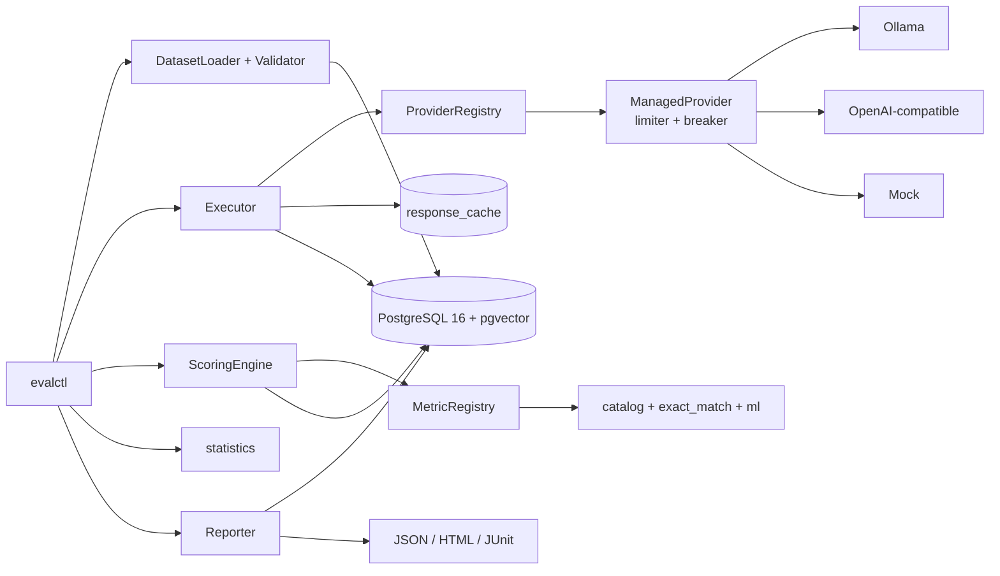

# Architecture

## Purpose

This document explains **what evalanche is made of**, the **seams you must not
violate**, and **where to find each responsibility in the tree**. For how data actually
moves through those components, read [dataplane.md](dataplane.md); for the rules that
justify these boundaries, read [principles.md](principles.md).

## What this system is

**evalanche** is a reproducible, resumable evaluation harness for language models. It
ships as:

- **`evalctl`** — a CLI for dataset validation, evaluation runs, zero‑inference
  scoring/rescoring, paired comparison, power analysis, and threshold calibration
- **PostgreSQL 16 + pgvector** — the single durable store for definitions, immutable
  generations, scores, and rollups
- **Providers** — Ollama (local), an OpenAI‑compatible adapter, and a deterministic
  Mock backend for CI/PoC, all wrapped by a managed runtime

There is no HTTP service (`evald`) in the current release; it is deferred (see
[guide.md §8.4](guide.md#84-known-gaps--deferred)).

## The load‑bearing idea

> **Generation and scoring are separate, independently versioned stages joined by a
> durable store.** You generate once; you score many times. Re‑scoring historical
> outputs must cost zero inference dollars.

The schema and module boundaries enforce this: `generations` are append‑only;
`scores` reference them by `(metric_name, metric_version, metric_config_sha256)`. This
one decision is why the metric catalog can grow, normalizers can change, and A/B
comparisons can be recomputed — all without re‑calling a model.

## Component map

## Where to find what (module map)

| Concern | Package / file | Responsibility |
|---------|----------------|----------------|
| CLI surface | `evalharness/cli.py` | Typer app: `dataset-validate`, `run`, `score`, `runs {rescore,compare}`, `power`, `calibrate` |
| Configuration | `evalharness/config.py` | `Settings` (env‑backed): DB URL, provider URLs, timeouts, retry/coverage defaults |
| Core types | `evalharness/core/{models,enums,protocols}.py` | `Case`, `Generation`, `ScoreValue`, `AggregateValue`; `TaskType`/`FailureOutcome`/`ErrorClass`; the `Provider` and `Metric` protocols |
| Datasets | `evalharness/datasets/{loader,validator}.py` | `manifest.yaml` + `cases.jsonl` → `Case`; fail‑fast validation, holdout guard, content hashing |
| Providers | `evalharness/providers/{ollama,openai_compatible,mock,registry,runtime,config}.py` | Adapters + entry‑point discovery + managed runtime (token buckets, concurrency, circuit breaker) |
| Execution | `evalharness/execution/executor.py` | Plan, bounded concurrency, retries, cache, three‑layer timeouts, checkpoint/resume, outcome classification |
| Scoring | `evalharness/scoring/{engine,registry,catalog,exact_match,normalizer,calibration,embeddings,ml,stats}.py` | Versioned metrics, zero‑inference rescore, per‑run aggregates |
| Statistics | `evalharness/statistics/{core,comparison}.py` | Wilson, BCa, paired bootstrap, McNemar, BH, Cohen's h, pass@k, power, flaky detection |
| Store | `evalharness/store/{models,repository,db}.py` | Async SQLAlchemy ORM, repository, Alembic‑owned session/engine |
| Reporting | `evalharness/reporting/report.py` + `templates/` | Coverage, histograms, latency, CIs; JSON/HTML/JUnit; publishability gate |
| Hashing / observability | `evalharness/{hashing,observability}.py` | Canonical SHA‑256 hashing; structlog + OpenTelemetry |
| Migrations | `alembic/versions/000{1,2,3}_*.py` | Schema evolution; `0003` adds correctness constraints/indexes |

## Seams (do not violate)

1. **`Provider` protocol** (`core/protocols.py`) — the only surface required to add a
   backend. Register via an `evalharness.providers` entry point. No executor, scorer,
   store, or CLI edits. See [providers.md](providers.md).
2. **`Metric` protocol** (`core/protocols.py`) — aggregation is metric‑specific; never
   assume `mean()`. A metric owns both its per‑item `score()` and its `aggregate()`.
   See [metrics.md](metrics.md).
3. **Content addressing** — datasets, templates, and run configs are SHA‑256 hashed;
   silent comparison across different hashes is forbidden. See [principles.md](principles.md).
4. **Harness vs model failures** — distinct outcomes; harness failures are excluded
   from model‑quality denominators. See [dataplane.md](dataplane.md#outcome-taxonomy).

## Versioning surface

Every run records enough to reproduce and to diff honestly:

- Dataset content SHA‑256, prompt‑template SHA‑256
- Resolved model version (Ollama digest / pinned revision; mock fixed digest)
- Decode params (temperature, max_tokens, seed, top_p, top_k, stop)
- Harness version + git SHA (`runs.config_sha256` folds these together)
- Metric name + version + config hash on **every** score row

## Current boundaries

**In:** single‑model Ollama / OpenAI‑compatible / mock runs; the full metric catalog;
zero‑inference rescore; resume; Wilson/BCa intervals; paired comparison with
McNemar/BH; latency percentiles; the failure taxonomy; JSON/HTML/JUnit reports.

**Deferred:** LLM‑as‑judge, object storage for raw payloads, the `evald` HTTP API,
native Anthropic/Google adapters, durable pgvector write path with HNSW. See
[`DEFERRED.md`](../DEFERRED.md) and [guide.md §8.4](guide.md#84-known-gaps--deferred).

## Related

- [dataplane.md](dataplane.md) — how a case becomes a report
- [schema.md](schema.md) — the durable store that joins the two stages
- [principles.md](principles.md) — why these seams exist
- [guide.md](guide.md) — the deep, example‑driven version of everything here
