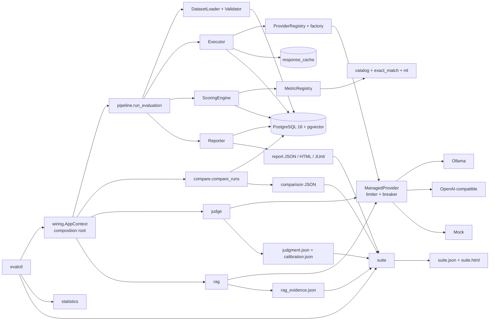

# Architecture

## Purpose

This document explains **what evalanche is made of**, the **seams you must not
violate**, and **where to find each responsibility in the tree**. For how data actually
moves through those components, read [dataplane.md](dataplane.md); for the rules that
justify these boundaries, read [principles.md](principles.md).

## What this system is

**evalanche** is a reproducible, resumable evaluation harness for language models. It
ships as:

- **`evalctl`** — a CLI for dataset validation, evaluation runs, zero‑inference
  scoring/rescoring, paired comparison, power analysis, threshold calibration,
  LLM‑as‑judge with holdout calibration, RAG evidence, and multi‑run benchmark suites
- **PostgreSQL 16 + pgvector** — the single durable store for definitions, immutable
  generations, scores, and rollups
- **Providers** — Ollama (local), an OpenAI‑compatible adapter, and a deterministic
  Mock backend for CI/PoC, all wrapped by a managed runtime

There is no HTTP service (`evald`) in the current release; it is deferred (see
[guide.md §8.4](guide.md#84-known-gaps--deferred)).

## The load‑bearing idea

> **Generation and scoring are separate, independently versioned stages joined by a
> durable store.** You generate once; you score many times. Re‑scoring historical
> outputs must cost zero inference dollars.

The schema and module boundaries enforce this: `generations` are append‑only;
`scores` reference them by `(metric_name, metric_version, metric_config_sha256)`. This
one decision is why the metric catalog can grow, normalizers can change, and A/B
comparisons can be recomputed — all without re‑calling a model.

## Component map

## Where to find what (module map)

| Concern | Package / file | Responsibility |
|---------|----------------|----------------|
| CLI surface | `evalharness/cli/` | `__init__.py` assembles the Typer app from one module per command: `power`, `score`, `calibrate`, `dataset`, `run`, `runs`, `suite`, `judge`, `rag`. `_common` holds the console/logger/JSON emitter, `_provider` the call policy and provider teardown shared by the live judge and RAG paths. Commands do argument parsing, console output, and exit codes only |
| Composition root | `evalharness/wiring.py` | `AppContext` (frozen) plus `build_app_context()`: the only place that picks concrete collaborators (settings, provider builder, scoring‑engine factory, run store). No DI framework and no container; services declare the same pieces as optional parameters that default to the production choice, so nothing below this module imports it |
| Run pipeline | `evalharness/pipeline/run.py` | `run_evaluation`: dataset load and validate, run row, execution, rescore, report write. Transport‑neutral, so the CLI and scripts drive the same path |
| Comparison | `evalharness/compare/service.py` | `compare_runs`: paired comparison of two stored runs on one metric, emitting the comparison artifact |
| Configuration | `evalharness/config.py` | `Settings` (env‑backed): DB URL, provider URLs, timeouts, retry/coverage defaults, judge/NLI capacity |
| Core types | `evalharness/core/{models,enums,protocols,ports}.py` | `Case`, `Generation`, `ScoreValue`, `AggregateValue`; `TaskType`/`FailureOutcome`/`ErrorClass`; the `Provider` and `Metric` protocols; the `RunStore` persistence port and its session‑bound factory |
| Shared constants | `evalharness/core/constants.py` | `OVERALL_SLICE`, `PRIMARY_METRIC`, and the published schema versions (`REPORT_SCHEMA_VERSION`, `COMPARE_SCHEMA_VERSION`, `SUITE_SCHEMA_VERSION`) |
| Datasets (harness) | `evalharness/datasets/{loader,validator}.py` | `manifest.yaml` + `cases.jsonl` → `Case`; fail‑fast validation, holdout guard, content hashing |
| Dataset factory (optional) | `packages/evaldatasets` (`evaldatasets`) | Offline adapters, `materialize_dataset`, synthetic source JSONL; depends on `evalanche`; installed via `evalanche[datasets]` / `--extra datasets`; CLI imports only inside `dataset materialize` |
| Providers | `evalharness/providers/{ollama,openai_compatible,mock,registry,factory,runtime,config,call_policy,retry,structured_output}.py` | Adapters, entry‑point discovery, `factory.build_managed_provider` for the CLI paths, managed runtime (token buckets, concurrency, circuit breaker), bounded non‑generation calls, `Retry-After` parsing, strict JSON output contracts |
| Execution | `evalharness/execution/executor.py` | Plan, bounded concurrency, retries, cache, three‑layer timeouts, checkpoint/resume, outcome classification |
| Scoring | `evalharness/scoring/{engine,registry,catalog,exact_match,normalizer,calibration,embeddings,ml,stats}.py` | Versioned metrics, zero‑inference rescore, per‑run aggregates |
| Statistics | `evalharness/statistics/{core,comparison}.py` | Wilson, BCa, paired bootstrap, McNemar, BH, Cohen's h, pass@k, power, flaky detection |
| Judge | `evalharness/judge/{runner,live,rubric,models,labels,pairwise,agreement,calibrate,text,io,errors,mock_responses}.py` | Pointwise and pairwise judging (deterministic mock runner and live provider runner), rubric loading, human‑label loading, holdout calibration, and the gating bit |
| RAG evidence | `evalharness/rag/{evidence,live,claims,citations,context,faithfulness,text,errors}.py` | `rag_evidence.json` from a run report plus evidence JSONL: qrels context precision/recall, claim decomposition, citation attribution, faithfulness through an optional NLI provider seam |
| Suite | `evalharness/suite/{loader,builder,render,models}.py` + `templates/` | Artifact‑only multi‑run benchmark suites: strict local validation of every declared artifact, deterministic assembly, offline HTML |
| Artifact contracts | `evalharness/artifacts/calibration.py` | `CalibrationArtifact` and friends, owned by neither the judge producer nor the suite consumer so the dependency stays one‑directional |
| Store | `evalharness/store/{models,repository,db}.py` | Async SQLAlchemy ORM, repository, Alembic‑owned session/engine |
| Reporting | `evalharness/reporting/report.py` + `templates/` | Coverage, histograms, latency, CIs; JSON/HTML/JUnit; publishability gate |
| Charts | `evalharness/charts.py` | Offline, byte‑reproducible Vega‑Lite embedding shared by `reporting` and `suite/render`; each view supplies its own theme |
| Hashing / observability | `evalharness/{hashing,observability,cli_progress}.py` | Canonical SHA‑256; structured events, privacy-safe payload summaries, progress callbacks/Rich adapter, OpenTelemetry |
| Migrations | `alembic/versions/000{1,2,3}_*.py` | Schema evolution; `0001` creates the baseline from the ORM metadata, `0003` adds correctness constraints/indexes |

## Seams (do not violate)

1. **`Provider` protocol** (`core/protocols.py`) — the only surface required to add a
   backend. Register via an `evalharness.providers` entry point. No executor, scorer,
   store, or CLI edits. See [providers.md](providers.md).
2. **`Metric` protocol** (`core/protocols.py`) — aggregation is metric‑specific; never
   assume `mean()`. A metric owns both its per‑item `score()` and its `aggregate()`.
   See [metrics.md](metrics.md).
3. **`RunStore` protocol** (`core/ports.py`) — every persistence call the pipeline,
   executor, scoring engine, and comparison make against one session.
   `store/repository.py:RunRepository` satisfies it structurally, so the store owns no
   back‑edge to the port. Those callers take the store from `AppContext` rather than
   constructing a repository, which is what makes the seam substitutable. `reporting`
   is the deliberate exception: it also reads three definition rows straight off the
   session, so it stays on the concrete repository until that is worth changing.
4. **Content addressing** — datasets, templates, and run configs are SHA‑256 hashed;
   silent comparison across different hashes is forbidden. See [principles.md](principles.md).
5. **Harness vs model failures** — distinct outcomes; harness failures are excluded
   from model‑quality denominators. See [dataplane.md](dataplane.md#outcome-taxonomy).

## Versioning surface

Every run records enough to reproduce and to diff honestly:

- Dataset content SHA‑256, prompt‑template SHA‑256
- Resolved model version (Ollama digest / pinned revision; mock fixed digest)
- Decode params (temperature, max_tokens, seed, top_p, top_k, stop)
- Harness version + git SHA (`runs.config_sha256` folds these together)
- Metric name + version + config hash on **every** score row

## The artifact model is file‑primary

PostgreSQL stores the generation and scoring stages: datasets, cases, runs,
generations, scores, aggregates, and the response cache. **Everything downstream of a
run is a file on disk, not a row.** Judgment, calibration, RAG evidence, suite, and
report artifacts are JSON (plus rendered HTML) written to a caller‑chosen path. Each
declares a `schema_version`; the calibration and suite artifacts additionally carry a
canonical‑JSON SHA‑256 over their own body; and every consumer revalidates and
re‑digests what it loads instead of trusting the file.

| Artifact | Produced by | Consumed by |
|----------|-------------|-------------|
| `{run_id}.json` / `.html` / `.xml` (report schema 2.1) | `pipeline.run_evaluation` → `reporting.write_report` | `evalctl suite {validate,build}` members; `evalctl rag evidence --report` |
| comparison JSON (schema 1.0) | `evalctl runs compare` → `compare.compare_runs` | `evalctl suite {validate,build}` compares |
| `judgment.json` | `evalctl judge run` → `judge/runner.py` (mock) or `judge/live.py` (provider) | `evalctl judge validate`, `evalctl judge attach-calibration`, suite `judge_artifacts` |
| `calibration.json` | `evalctl judge validate` → `judge/calibrate.py` | `evalctl judge attach-calibration`, suite `calibrations` |
| `rag_evidence.json` (schema 0.1) | `evalctl rag evidence` → `rag/evidence.py` (mock NLI) or `rag/live.py` (provider NLI) | suite `rag_artifacts` |
| `suite.json` / `suite.html` (schema 0.1) | `evalctl suite build` → `suite/builder.py`, `suite/render.py` | Humans and CI |

Loading is strict, not trusting. A suite manifest is untrusted input, so
`suite/loader.py` resolves every declared path inside the manifest tree and refuses
`../` traversal or an absolute path, rejects an unexpected `schema_version`, requires
the fields each artifact kind must carry, parses calibration payloads against
`artifacts/calibration.py`, records a canonical‑JSON SHA‑256 per loaded payload, and
refuses a RAG artifact whose `gating_allowed` is anything but `false`. Likewise,
`evalctl judge attach-calibration` re‑derives both the calibration body digest and the
judgment identity digest rather than trusting either as written.

## Current boundaries

**In:** single‑model Ollama / OpenAI‑compatible / mock runs; the full metric catalog;
zero‑inference rescore; resume; Wilson/BCa intervals; paired comparison with
McNemar/BH; latency percentiles; the failure taxonomy; JSON/HTML/JUnit reports;
LLM‑as‑judge; RAG evidence artifacts; multi‑run benchmark suites.

**LLM‑as‑judge, specifically.** `evalharness/judge/` ships pointwise scoring against a
versioned rubric and pairwise preference with position‑swap resolution, over either the
deterministic mock runner or a live provider through the same managed runtime as
generation. A pairwise graph is summarised as raw win rates and reports its own
connectivity; the harness does not fit Bradley‑Terry strengths. **Judgments are
informational by default.** `evalctl judge validate` computes holdout agreement against
human labels and sets `gating_allowed` only when a dev split exists, the judge and
candidate model families are separated, the holdout and dev sample sizes clear their
floors, and holdout agreement clears the threshold. `evalctl judge attach-calibration`
copies a passing calibration digest onto a judgment artifact; without that digest, a
judgment is a signal to read, never a gate.

**Deferred:** object storage for raw payloads, the `evald` HTTP API, native
Anthropic/Google adapters, and a durable pgvector write path with HNSW. See
[`DEFERRED.md`](../DEFERRED.md) and
[guide.md §8.4](guide.md#84-known-gaps--deferred).

## Related

- [dataplane.md](dataplane.md) — how a case becomes a report
- [schema.md](schema.md) — the durable store that joins the two stages
- [principles.md](principles.md) — why these seams exist
- [guide.md](guide.md) — the deep, example‑driven version of everything here
