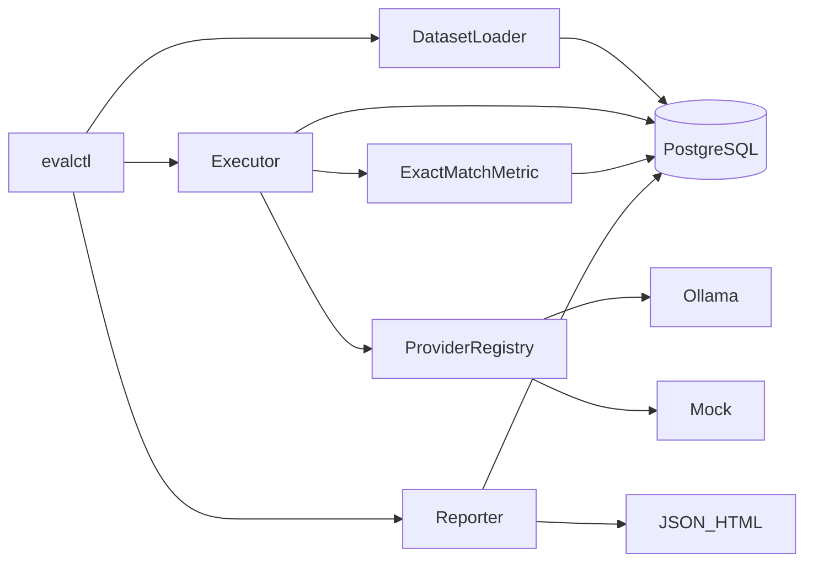

# Architecture

## What this system is

**evalanche** is a reproducible, resumable evaluation harness for language models. The current release ships:

- **`evalctl`** — CLI for dataset validation and evaluation runs
- **PostgreSQL 16 + pgvector** — durable store for definitions, immutable generations, and scores
- **Ollama** — primary local inference backend (plus a **mock** provider for CI/PoC)

The HTTP service (`evald`) is not in the current release.

## Load-bearing idea

**Generation and scoring are separate, independently versioned stages joined by a durable store.**

You generate once. You score many times. Re-scoring historical outputs must cost zero inference dollars. The schema and module boundaries enforce this: `generations` are append-only; `scores` reference them with `(metric_name, metric_version, metric_config_sha256)`.

## Component map

| Component | Package | Responsibility |
|-----------|---------|----------------|
| Dataset loader + validator | `evalharness.datasets` | Manifest + JSONL → `Case`; fail-fast validation |
| Provider registry | `evalharness.providers` | Entry-point discovery; one file to add a backend |
| Executor | `evalharness.execution` | Plan, concurrency, retries, cache, checkpoint, resume |
| Scoring | `evalharness.scoring` | Versioned normalizer + exact match + Wilson / percentiles |
| Store | `evalharness.store` | Async SQLAlchemy repository |
| Reporting | `evalharness.reporting` | Aggregates, coverage floor, JSON/HTML |

## Seams (do not violate)

1. **`Provider` protocol** — only surface required to add a backend. Register via `evalharness.providers` entry points.
2. **`Metric` protocol** — aggregation is metric-specific; never assume `mean()`.
3. **Content addressing** — datasets, templates, and run configs are SHA-256 hashed; silent comparison across different hashes is forbidden.
4. **Harness vs model failures** — distinct outcomes; harness failures are excluded from model-quality denominators.

## Versioning surface

Every run records:

- Dataset content SHA-256
- Prompt template SHA-256
- Resolved model version (Ollama digest; mock fixed digest)
- Decode params
- Harness version + git SHA
- Metric name + version + normalizer config hash on each score row

## Current boundaries

**In:** single-model Ollama/mock runs, exact match, resume, Wilson CI, latency percentiles, failure taxonomy, reports.

**Out:** hosted providers beyond Ollama, full metric catalog, LLM-as-judge, `evald` API, object storage (see local deferred notes).

> Package branding is **evalanche**; the Python import path remains `evalharness` and the CLI remains `evalctl`.
