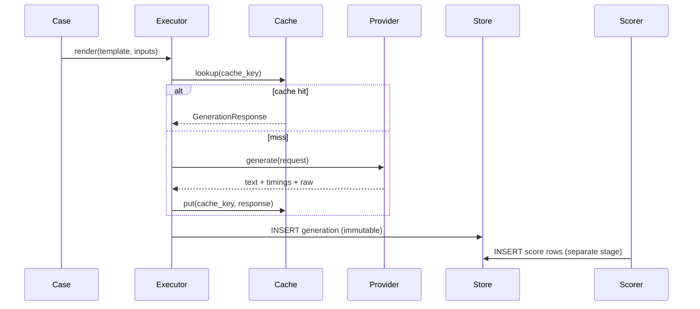

# Data plane

End-to-end path for one evaluation case.

## Pipeline



Generation and scoring are separate stages. `evalctl run` executes generations then calls `ScoringEngine.rescore_run`; reporting is read-only over stored rows.

## Cache key

SHA-256 of canonical JSON:

```text
{provider, model_version, rendered_prompt, decode_params, adapter_version}
```

Hits set `generations.cached = true` and skip inference. Cache puts are race-safe (`ON CONFLICT DO NOTHING`).

## Outcome taxonomy

Every case terminates in exactly one **generation** outcome (mutually exclusive):

| Outcome | Meaning | In coverage denominator? |
|---------|---------|--------------------------|
| `passed` | Provider returned usable output | Yes |
| `refused` / `truncated` / `empty_output` / `content_filtered` / `model_error` | Model-side | Yes |
| `harness_timeout` / `harness_error` | Infrastructure | **No** — coverage loss |
| `skipped` | Explicitly skipped | No |

**Pass/fail quality** is derived from versioned `scores` rows (`passed` on metrics such as `exact_match`), not from mutating `generations.outcome` after scoring.

## Coverage and publishability

- **Planned cardinality** = `cases × repeats`
- **Coverage** = `(written_generations − harness_failures) / planned`
- **Publishable** only when `run.status == completed`, `written == planned`, and coverage ≥ floor (default `0.98`). Partial or cancelled runs are withheld.

## Retries

- Retry only `RETRYABLE_TRANSIENT` and `RETRYABLE_RATE_LIMIT`
- Full jitter backoff with real `await asyncio.sleep`: base `0.5s`, cap `30s`, max 5 retries
- Honor HTTP `Retry-After` when present (max of jitter and server hint)
- Every attempt appended to `attempt_log` (retries are data)

## Timeouts (three layers)

1. **Per-request** — `asyncio.wait_for` around provider `generate` (`default_request_timeout_s`); `httpx.TimeoutException` maps to harness timeout taxonomy
2. **Per-case** — wall clock including retries (`default_case_timeout_s`); writes idempotent `harness_timeout` generation row on expiry
3. **Per-run** — executor wall budget (`default_run_timeout_s`); triggers drain then `failed` / `cancelled` status

## Concurrency and shutdown

- Bounded worker-queue pool (not one `Task` per case) for large runs
- SIGTERM/SIGINT sets a shutdown flag; workers drain for `default_shutdown_drain_timeout_s`, then cancel
- Final run status: `completed` only when all planned keys are written; otherwise `failed` or `cancelled`

## Resume

`UNIQUE (run_id, case_id, repeat_idx)` plus `ON CONFLICT DO NOTHING` makes checkpoints idempotent. `--resume RUN_ID` re-plans missing keys and verifies dataset/template/model/config FKs and `config_sha256` match the stored run.

## Reporting

After execution and scoring, the reporter:

1. Loads generations, scores, and metric aggregates (read-only)
2. Computes coverage from planned cardinality and harness outcomes
3. Computes pass rate with **Wilson 95% CI** from score rows
4. Writes `{run_id}.json`, `{run_id}.html`, and `{run_id}.xml`
5. Refuses publishability unless the run completed with full planned coverage

## Offline PoC path

The **mock** provider returns deterministic text and timings so CI and committed fixtures prove the full plane without Ollama. See [Operations](operations.md#proof-of-concept).
