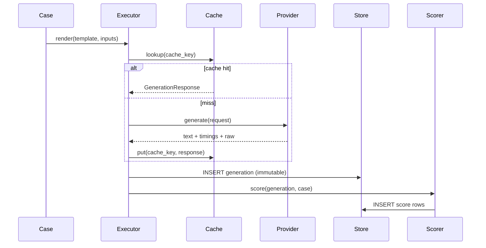

# Data plane

End-to-end path for one evaluation case.

## Pipeline



## Cache key

SHA-256 of canonical JSON:

```text
{provider, model_version, rendered_prompt, decode_params, adapter_version}
```

Hits set `generations.cached = true` and skip inference.

## Outcome taxonomy

Every case terminates in exactly one outcome (mutually exclusive):

| Outcome | Meaning | In model-quality denominator? |
|---------|---------|-------------------------------|
| `passed` | Scored and passed | Yes |
| `failed_score` | Generated OK, metric failed | Yes |
| `refused` / `truncated` / `empty_output` / `content_filtered` / `model_error` | Model-side | Yes (quality) |
| `harness_timeout` / `harness_error` | Infrastructure | **No** — coverage loss |
| `skipped` | Explicitly skipped | No |

**Coverage** = `1 − harness_failures / total`. Default publish floor: `0.98`. Below floor → report marked non-publishable; CLI exits `2`.

## Retries

- Retry only `RETRYABLE_TRANSIENT` and `RETRYABLE_RATE_LIMIT`
- Full jitter backoff: base `0.5s`, cap `30s`, max 5 retries
- Every attempt appended to `attempt_log` (retries are data)

## Timeouts (three layers)

1. Per-request — provider HTTP timeout
2. Per-case — including retries (`default_case_timeout_s`)
3. Per-run — wall budget (configured at settings; service enforcement comes with the HTTP API)

## Resume

`UNIQUE (run_id, case_id, repeat_idx)` makes checkpoints idempotent. `--resume RUN_ID` re-plans only missing keys.

## Reporting

After execution, the reporter:

1. Loads generations + scores for the run
2. Computes coverage, outcome histogram, finish-reason histogram
3. Computes latency p50/p90/p95/p99/max + mean (mean labeled separately)
4. Computes pass rate with **Wilson 95% CI** on non-harness cases
5. Writes `{run_id}.json` and `{run_id}.html`
6. Persists `metric_aggregates`

## Offline PoC path

The **mock** provider returns deterministic text and timings so CI and committed fixtures prove the full plane without Ollama. See [Operations](operations.md#proof-of-concept).
