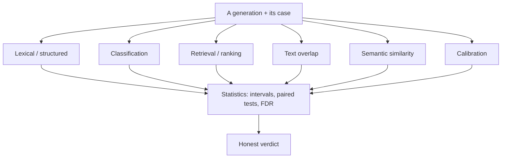

# The evalanche metrics catalog

This is the **deep drill‑down** on every metric evalanche ships. If you want the short
narrative — *which* metric to reach for and why the families compose — read
[`../metrics.md`](../metrics.md) first. This catalog is where you come when you need the
formula, the exact registered name, the config knobs, the edge cases, and the code that
implements them.

Two audiences are served on purpose:

- **"I have no idea what any of this is."** Every metric doc opens with a plain‑language
  TL;DR and a worked mini‑example with tiny numbers before any math appears. Read the
  first two sections of a page and you will understand what the number means.
- **"I know this cold, give me the rigorous refresher."** Below the intuition you get the
  formal definition, ranges, aggregation behavior, the registered `name`/`version`,
  every config parameter, and the pitfalls that actually bite in production.

Everything here is grounded in the code on `main`. When this catalog and your memory
disagree, the code wins — each page links the exact module and symbol.

---

## What a metric *is* here

A metric is not a number. It is a **versioned opinion about a generation** that you can
trust to diff. Every metric implements the `Metric` protocol in
[`core/protocols.py`](../../src/evalharness/core/protocols.py):

```35:43:src/evalharness/core/protocols.py
class Metric(Protocol):
    name: str
    version: str
    task_types: frozenset[TaskType]
    requires: frozenset[Requirement]

    def score(self, gen: Generation, case: Case, ctx: ScoringContext) -> list[ScoreValue]: ...

    def aggregate(self, values: list[ScoreValue]) -> AggregateValue: ...
```

- **`name` / `version`** — identity. A changed implementation is a new version, never a
  silent overwrite.
- **`task_types`** — the `TaskType`s ([`core/enums.py`](../../src/evalharness/core/enums.py))
  the metric is allowed to score. The engine refuses a mismatch.
- **`requires`** — data prerequisites (`REFERENCE`, `QRELS`, …) the case must satisfy.
- **`score()`** — produces one or more `ScoreValue`s for a **single** generation.
- **`aggregate()`** — rolls many `ScoreValue`s into one `AggregateValue`. **Aggregation is
  metric‑specific — never assume `mean()`.** BLEU aggregates as a corpus score;
  classification aggregates as accuracy with a confusion‑style detail payload; a pass rate
  aggregates with a Wilson interval.

Because scoring is a [separate stage](../dataplane.md#the-two-stages) from generation, you
can add or change a metric and **rescore historical runs at zero inference cost**. Each
score row records `metric_config_sha256`, so a changed config produces a *new* opinion
beside the old one instead of clobbering it. See
[principles #1, #5, #6](../principles.md).

### The registered metrics (ground truth)

`MetricRegistry.discover()` ([`scoring/registry.py`](../../src/evalharness/scoring/registry.py))
registers `exact_match` plus every metric on the `evalharness.metrics` entry-point group,
one module per metric under [`scoring/metrics/`](../../src/evalharness/scoring/metrics/).
Confirm the live list, and why anything is disabled, at any time:

```bash
uv run evalctl metrics list
```

Today that enables 17 names:

```
['assertions', 'bertscore_f1', 'chrf_pp', 'classification', 'exact_match',
 'json_field_f1', 'json_validity', 'meteor', 'normalized_levenshtein',
 'numeric_assertion', 'retrieval_map', 'retrieval_mrr', 'retrieval_ndcg_10',
 'retrieval_precision_at_k', 'rouge_l', 'sacrebleu', 'squad_f1']
```

`METRIC_FAMILIES` and `METRICS_ENABLED` narrow that set; see
[metrics.md](../metrics.md#the-mental-model).

Two more layers exist beyond the registry:

- **`bertscore_f1`** — registered on the same entry-point group but only importable with
  the `metrics-ml` extra ([`scoring/ml.py`](../../src/evalharness/scoring/ml.py)); without
  it the metric is reported as unavailable rather than breaking discovery.
- **Helper families that are *not* registry metrics** — calibration
  ([`scoring/calibration.py`](../../src/evalharness/scoring/calibration.py)), semantic
  similarity ([`scoring/embeddings.py`](../../src/evalharness/scoring/embeddings.py)), and
  the statistics package ([`statistics/`](../../src/evalharness/statistics/)). They are
  called by `evalctl calibrate` / `power` / `runs compare` and from research code, not by
  `runs rescore --metrics`.

`evalctl run` scores `exact_match` by default; reach for the rest via
`evalctl runs rescore --metrics …` or `evalctl score`.

---

## The family map



| Family | Question it answers | Registered / code symbols | Start here |
|--------|--------------------|--------------------------|-----------|
| [Lexical & structured](lexical-structured/README.md) | "Does the text match the reference exactly / almost, or satisfy hard constraints and JSON shape?" | `exact_match`, `squad_f1`, `normalized_levenshtein`, `assertions`, `numeric_assertion`, `json_validity`, `json_field_f1` | Short‑form QA, extraction, fast regression gates |
| [Classification](classification/README.md) | "How good are the labels, accounting for imbalance?" | `classification` | Label tasks (report MCC, not just accuracy) |
| [Calibration](calibration/README.md) | "Does the model know when it doesn't know?" | `calibration.py` helpers, `evalctl calibrate` | You have real confidences and care about selective prediction |
| [Retrieval & ranking](retrieval-ranking/README.md) | "Are the right documents ranked highly?" | `retrieval_ndcg_10`, `retrieval_precision_at_k`, `retrieval_mrr`, `retrieval_map` | Retrieval / RAG with graded `qrels` |
| [Text overlap](text-overlap/README.md) | "How much surface content is shared with the reference?" | `rouge_l`, `sacrebleu`, `chrf_pp`, `meteor`, `bertscore_f1` (extra) | Summarization / translation tripwires |
| [Semantic similarity](semantic-similarity/README.md) | "Is the *meaning* close, beyond exact wording?" | `EmbeddingService` | Paraphrase‑tolerant checks with a calibrated threshold |
| [Statistics](statistics/README.md) | "Is the difference real, or noise?" | `statistics/` package | Every published number and every A/B |

---

## How to pick metrics per task type

`TaskType` lives in [`core/enums.py`](../../src/evalharness/core/enums.py). The engine
([`scoring/engine.py`](../../src/evalharness/scoring/engine.py) → `ScoringEngine.validate`)
rejects a metric whose `task_types` set does not contain the case's type, so this table is
also the **compatibility contract**, not just advice.

| `TaskType` | Cheap gate | Primary quality metric | Add for depth |
|-----------|-----------|------------------------|---------------|
| `qa_short` | `exact_match` | `squad_f1` | `normalized_levenshtein`, semantic similarity |
| `generation` | `exact_match` / `assertions` | task‑dependent | `rouge_l`, `sacrebleu`, semantic similarity |
| `summarization` | `assertions` | `rouge_l` | `chrf_pp`, `meteor`, `bertscore_f1` |
| `extraction` | `json_validity` | `json_field_f1` | `assertions`, `numeric_assertion` |
| `tool_use` | `json_validity` | — | `assertions` |
| `classification` | `classification` | `classification` (MCC / balanced acc) | calibration if you have confidences |
| `retrieval` / `rag` | — | `retrieval_ndcg_10` | overlap / semantic on the generated answer (RAG) |

Note the asymmetry: `assertions`, `numeric_assertion`, `json_validity`, and `json_field_f1`
declare **no** `Requirement`, so they run without a reference; `exact_match`, `squad_f1`,
`normalized_levenshtein`, and the overlap metrics require `REFERENCE`; `retrieval_ndcg_10`
requires `QRELS`.

---

## How metrics compose (the honesty layering)

A trustworthy evaluation layers families instead of betting on one number:

1. **Gate cheaply.** A deterministic tripwire (`exact_match`, `assertions`,
   `json_validity`) gives you the headline pass rate with a Wilson interval.
2. **Measure quality appropriately.** Add the task‑fit metric — `squad_f1` for QA,
   `classification` for labels, `retrieval_ndcg_10` for ranking, `rouge_l`/`sacrebleu` for
   summaries, semantic similarity for paraphrase tolerance.
3. **Separate infra from model.** Coverage from the
   [outcome taxonomy](../dataplane.md#outcome-taxonomy) confirms harness failures did not
   distort the denominator ([principle #3](../principles.md)).
4. **Compare honestly.** `evalctl runs compare` runs paired McNemar + BCa deltas +
   Cohen's h, with Benjamini–Hochberg across everything you report, excluding flaky cases.

Because all of this runs over stored generations, step 2 can be added to a finished run
months later without re‑inferring a single token.

---

## Reading a metric page

Every per‑metric page follows the same flow so you can skim or go deep predictably:

1. **TL;DR** — one line, plain language.
2. **What it measures & why** — the question it answers.
3. **Intuition** — a worked mini‑example with tiny numbers.
4. **Formal definition** — the formula.
5. **Inputs & requirements** — task types and the `Case`/`Generation` fields it reads.
6. **Output** — range, what high/low means, per‑case vs corpus aggregation.
7. **Registered name / version & config** — copied from the code.
8. **Pitfalls** — where it misleads.
9. **Composition** — how it plays with other metrics.
10. **References & code** — papers, tools, and deep links to source + the guide.

---

## Related

- [`../metrics.md`](../metrics.md) — the concise narrative that points into this catalog
- [guide §6](../guide.md#6-metric-catalog--statistics) — formulas, ranges, thresholds in one place
- [guide §5.5](../guide.md#55-query-library) — the SQL that reads these scores back out
- [`../principles.md`](../principles.md) — versioning and interval non‑negotiables
- [`../dataplane.md`](../dataplane.md) — the two‑stage generate/score pipeline
