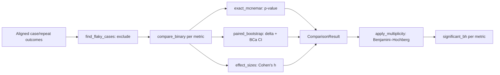

# Statistics: honest comparison

**Metrics produce point estimates; statistics decide whether a difference is real.** A bare
"92%" hides whether *n = 25* or *n = 25,000*, and "candidate beat baseline by 1.5%" is
meaningless without a confidence interval and a significance test. This family is the
harness's answer to [principle #4](../../principles.md): **no point estimate without an
interval.**

Everything lives in the [`statistics/`](../../../src/evalharness/statistics/) package
(`core.py` + `comparison.py`), re‑exported from
[`statistics/__init__.py`](../../../src/evalharness/statistics/__init__.py). A few Wilson /
percentile helpers are duplicated in
[`scoring/stats.py`](../../../src/evalharness/scoring/stats.py) for the scoring path. These
are **functions, not registry metrics** — they power `evalctl runs compare`, `evalctl
power`, and the metric aggregates.

## The tools

| Doc | Function(s) | Question it answers |
|-----|-------------|---------------------|
| [Wilson interval](wilson.md) | `wilson_interval` | What's the CI on a pass rate / proportion? |
| [Bootstrap CIs](bootstrap.md) | `bca_bootstrap`, `paired_bootstrap` | What's the CI on a mean, or on a paired delta? |
| [McNemar & comparison](mcnemar.md) | `exact_mcnemar`, `compare_binary`, `apply_multiplicity` | Is a paired A/B difference significant? |
| [Benjamini–Hochberg](benjamini-hochberg.md) | `benjamini_hochberg` | How do I not fool myself testing many metrics? |
| [Effect sizes](effect-sizes.md) | `effect_sizes` (Cohen's h, deltas) | Is the difference *meaningful*, not just significant? |
| [pass@k](pass-at-k.md) | `pass_at_k` | If any of k samples may succeed, what's the unbiased rate? |
| [Power & sample size](power.md) | `required_sample_size` | How many cases do I need *before* running? |

Two more helpers round out the package (covered in [McNemar & comparison](mcnemar.md)):
`between_repeat_variance` (mean of per‑case sample variances — a stability diagnostic) and
`find_flaky_cases` (cases with >1 distinct boolean outcome across repeats, **excluded from
compare claims but never from storage**).

## The comparison pipeline (`evalctl runs compare`)

`compare_binary` ([`comparison.py`](../../../src/evalharness/statistics/comparison.py))
bundles the paired bootstrap delta, exact McNemar p‑value, and Cohen's h into one
`ComparisonResult`; `apply_multiplicity` then runs Benjamini–Hochberg across the list and
flips `significant_bh`.

## Cross‑cutting gotchas

- **Small n ⇒ honestly wide intervals.** Widen the dataset, don't shrink the CI.
- **Seed bootstraps when publishing** (`seed=`, default 0) for reproducibility.
- **Significance ≠ magnitude.** Always report [Cohen's h](effect-sizes.md) beside the
  p‑value.
- **pass@k is not "best of k, score once"** without recording \(n, c, k\).

## Related

- Guide: [§6.7](../../guide.md#67-statistics-package).
- Narrative: [`metrics.md`](../../metrics.md#statistics-honest-comparison).
- Principle: [#4 — no point estimate without an interval](../../principles.md).
- Test (golden values): [`tests/test_statistics_catalog.py`](../../../tests/test_statistics_catalog.py),
  [`tests/test_stats.py`](../../../tests/test_stats.py).
