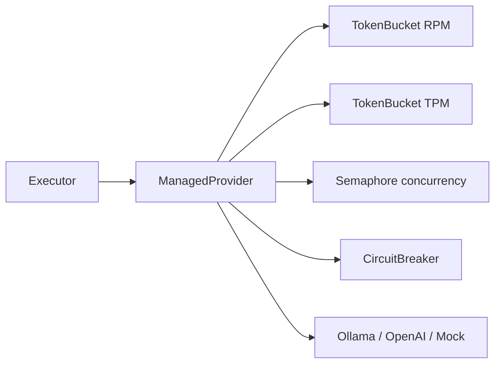

# Providers

## Purpose

This document explains the **provider seam** — the single, small surface you implement
to add an inference backend — the adapters that ship today, and the **managed runtime**
(rate limiter + circuit breaker) that wraps every adapter. The overriding design goal is
[principle #9](principles.md): a new backend is one new file plus one entry‑point line,
with no changes to the executor, scorer, store, or CLI.

## The `Provider` protocol

Providers implement `evalharness.domain.provider.Provider`:

| Method | Responsibility |
|--------|----------------|
| `resolve_version(model)` | Return an immutable `ModelVersion` — a **pinned revision/digest**, not a moving tag. This is what makes "same run, six months later" meaningful. |
| `capabilities(model)` | Declare *actual* capabilities (seed, tools, JSON schema, streaming, system role, max context). |
| `generate(model, req)` | Produce a `GenerationResponse` (text, finish reason, tokens, timings, raw payload). |
| `embed(model, texts)` | Batch‑embed text (used by the embedding service). |
| `classify_error(exc)` | Map an exception to an `ErrorClass` so the executor can decide retry policy. |

Two rules keep behavior uniform:

- **Adapters must not implement retries.** The executor owns retry policy and honors
  `Retry-After` (see [dataplane.md](dataplane.md#retries-executor-owned)).
- **Never log credentials, authorization headers, prompts, or raw responses.**

## Adapters that ship

| Provider (entry‑point name) | File | Notes |
|-----------------------------|------|-------|
| `ollama` | `providers/ollama.py` | Local inference. Resolves the pinned digest from `GET /api/tags` (fallback `/api/show`); streams `POST /api/chat`; embeds via `POST /api/embed`. Pull the model first or resolution fails with "has no digest". |
| `openai_compatible` | `providers/openai_compatible.py` | Any OpenAI‑style endpoint. Requires an explicit `model_revision` — an API alias is *not* a reproducible version. Configured via `OPENAI_COMPATIBLE_*` settings. |
| `mock` | `providers/mock.py` | Deterministic text + timings for CI and the committed PoC; no GPU. |

Error classification (`classify_error`) is the contract the executor relies on: `429` →
`RETRYABLE_RATE_LIMIT`; `5xx` / timeouts / connection errors → `RETRYABLE_TRANSIENT`;
`401/403` → `NON_RETRYABLE_AUTH`; other `4xx` → `NON_RETRYABLE_REQUEST`. See the mapping
table in [guide.md §7.3](guide.md#73-mapping-ollama-signals--harness).

## The managed runtime

Every adapter is wrapped by `ManagedProvider` (`providers/runtime.py`) via
`create_provider`. It adds the resilience machinery so adapters stay simple:



- **Token buckets** for requests‑per‑minute and tokens‑per‑minute (estimated tokens ≈
  `len(chars)/3 + max_tokens`). Time spent waiting is recorded on
  `generations.queue_wait_ms`.
- **Concurrency semaphore** bounds in‑flight requests.
- **Circuit breaker** — `CLOSED` → `OPEN` after `failure_threshold` consecutive
  failures (default 5) → `HALF_OPEN` after `recovery_timeout_s` (default 30s). While
  open, calls raise `CircuitOpenError`, which classifies as retryable‑transient so the
  executor backs off rather than hammering a failing backend.

Per‑provider limits live in `providers/config.py` (`OllamaConfig`,
`OpenAICompatibleConfig`): RPM, TPM, and concurrency defaults differ by backend.

## Live judge and NLI calls

`evalctl judge run` and `evalctl rag evidence` use the same `Provider` and
`ManagedProvider` path as generation. Their call policy is intentionally outside
the adapters:

- concurrency defaults to 2 and is configurable with `--concurrency`;
- every model-resolution and generation call has an explicit
  `--request-timeout` (default `DEFAULT_REQUEST_TIMEOUT_S`, 60 seconds);
- transient and rate-limit failures use the executor's bounded full-jitter policy
  and honor `Retry-After`; adapters still perform no retries;
- judge capacity uses `JUDGE_PROVIDER_RPM` / `JUDGE_PROVIDER_TPM`, while NLI uses
  `NLI_PROVIDER_RPM` / `NLI_PROVIDER_TPM`;
- the CLI creates one pooled provider client per command and closes it in `finally`.

Both workflows request strict JSON schema output and validate it again after
removing at most one outer markdown fence. Invalid JSON, extra fields, invalid
labels, and out-of-range scores fail closed. Artifacts record the digest returned
by `resolve_version`, not the requested model tag.

## Adding a provider

1. Create `providers/yourbackend.py` implementing the `Provider` protocol.
2. Add one line under `[project.entry-points."evalharness.providers"]` in
   `pyproject.toml`:

   ```toml
   yourbackend = "evalharness.providers.yourbackend:YourProvider"
   ```

3. That's it — the registry discovers it, `create_provider` wraps it in the managed
   runtime, and `evalctl run --provider yourbackend` works. No executor, scorer, store,
   or CLI edits.

Contract tests should use recorded `respx` responses and dummy credentials rather than
hitting a live endpoint.

## Related

- [architecture.md](architecture.md#seams-do-not-violate) — why this seam exists
- [dataplane.md](dataplane.md) — retries, timeouts, and where the runtime fits
- [operations.md](operations.md) — configuring and running each provider
- [guide.md §7](guide.md#7-reading-the-logs-harness--ollamallamacpp) — decoding Ollama logs and mapping them to harness metrics
