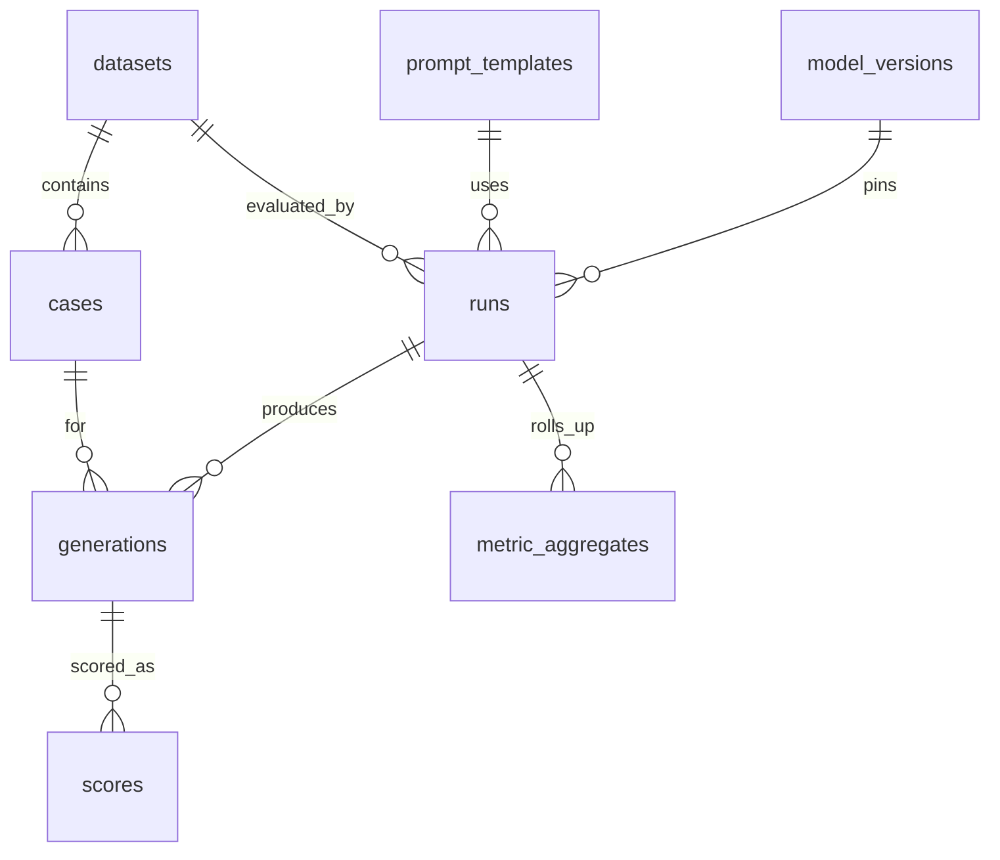

# Database schema

PostgreSQL 16 + `pgvector`. **Alembic is the sole schema owner** — `init_db()` runs `alembic upgrade head`; runtime code never calls `create_all`.

Raw provider payloads live in **`generations.raw_response` (JSONB)** — not object storage. Revisit triggers are local-only (`DEFERRED.md`).

## Entity relationships



## Tables

### Definitions (mostly immutable after insert)

| Table | Purpose | Key uniqueness |
|-------|---------|----------------|
| `datasets` | Named dataset version + content hash + manifest | `(name, version)` — hash mismatch on existing row is a hard error |
| `cases` | One eval case | `(dataset_id, external_id)` |
| `prompt_templates` | Template body + hash | `(name, version)` — hash mismatch on existing row is a hard error |
| `model_versions` | Provider + model + **resolved** version + quant | `UNIQUE (provider, model, resolved_version, COALESCE(quantization, ''))` |

### Runs

| Table | Purpose |
|-------|---------|
| `runs` | Job metadata: decode params, `config_sha256`, status, tenant, harness/git versions |

Statuses: `queued` → `running` → `completed` | `failed` | `cancelled`.

### Immutable outputs

| Table | Purpose |
|-------|---------|
| `generations` | One row per `(run_id, case_id, repeat_idx)` — **never update** after insert |
| `scores` | Metric results referencing `generation_id`; pass/fail quality lives here |
| `metric_aggregates` | Overall (and later slice) rollups with CI method |

### Forward-compatible (schema present, unused in current scoring paths)

`judgments`, `annotations`, `embeddings` — reserved for judge, human labels, and embedding metrics.

### Cache

`response_cache` — `cache_key` PK → JSON response payload (`ON CONFLICT DO NOTHING` on put).

## Generation columns of note

- `outcome` — provider/harness failure taxonomy at generation time (not post-score quality)
- `raw_response` — provider payload JSONB
- `attempt_log` — retry history
- `trace_id` — OTel linkage
- `ttft_ms` / `total_ms` — latency

## Migrations

| Revision | Change |
|----------|--------|
| `0001_initial` | Full baseline DDL (`IF NOT EXISTS` guards for existing PoC DBs) |
| `0002_raw_response_jsonb` | `raw_response` JSONB; drop legacy `raw_uri` |
| `0003_foundation_correctness` | Metric aggregate identity + config hash, btree indexes, NULL-safe model uniqueness |

Bootstrap:

```bash
uv run alembic upgrade head
# or
uv run python -c "import asyncio; from evalharness.store.db import init_db; asyncio.run(init_db())"
```

## Indexing and idempotency

- GIN on `cases.slices` (`jsonb_path_ops`) for slice filters
- Btree on `generations(run_id)` and `scores(generation_id)`
- `UNIQUE (run_id, case_id, repeat_idx)` — checkpoint inserts use `ON CONFLICT DO NOTHING`
- `UNIQUE (run_id, metric_name, metric_version, slice_key, metric_config_sha256)` on `metric_aggregates` with upsert on aggregate writes
- `UNIQUE (generation_id, metric_name, metric_version, metric_config_sha256)` on `scores`
