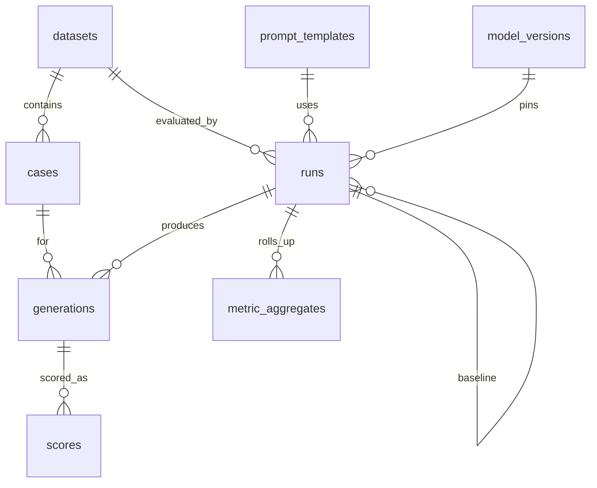

# Database schema

## Purpose

This document is the **map** of the PostgreSQL model: the table groups, the constraints
that enforce our invariants, and the migration that hardened them. It is intentionally
concise. For the full column‑by‑column reference and a copy‑paste **SQL query library**,
see [guide.md §5](guide.md#5-database-deep-dive) — that is the one home for schema
detail and queries.

PostgreSQL 16 + `pgvector`. **Alembic is the sole schema owner** — `init_db()` runs
`alembic upgrade head`; runtime code never calls `create_all`. Raw provider payloads
live in **`generations.raw_response` (JSONB)**, not object storage (a deliberate,
documented deferral in [`DEFERRED.md`](../DEFERRED.md)).

## Table groups

The schema divides cleanly into three groups that mirror the [data plane](dataplane.md):

1. **Definitions** — append‑once, content‑addressed inputs: `datasets`, `cases`,
   `prompt_templates`, `model_versions`.
2. **Run + immutable outputs** — the evaluation record: `runs`, `generations`,
   `scores`, `metric_aggregates`.
3. **Operational cache** — `response_cache` for temperature‑0 provider responses.

Judge, calibration, and RAG evidence are **file artifacts**, not rows.

## Entity relationships



## Definitions (mostly immutable after insert)

| Table | Purpose | Key uniqueness |
|-------|---------|----------------|
| `datasets` | Named dataset version + content hash + manifest | `(name, version)` — a hash mismatch on an existing row is a hard error |
| `cases` | One eval case (inputs, packed reference, qrels, slices) | `(dataset_id, external_id)`; GIN index on `slices` |
| `prompt_templates` | Template body + hash | `(name, version)` — hash mismatch is a hard error |
| `model_versions` | Provider + model + **resolved** version + quant + capabilities | `UNIQUE (provider, model, resolved_version, COALESCE(quantization, ''))` |

**Why hash content, not trust version strings?** Humans forget to bump versions.
`validate_dataset` refuses a run when the recomputed content hash disagrees with the
manifest — this is content addressing (principle #2) enforced in code.

## Runs and immutable outputs

| Table | Purpose | Notes |
|-------|---------|-------|
| `runs` | Job metadata: decode params, `config_sha256`, status, tenant, harness/git versions, optional `baseline_run_id` | Statuses: `queued`→`running`→`completed`\|`failed`\|`cancelled` |
| `generations` | One row per `(run_id, case_id, repeat_idx)` — **never updated** after insert | Holds output, `outcome`, latency, `attempts`, `attempt_log`, `cached`, `raw_response`, `trace_id` |
| `scores` | Metric results referencing `generation_id` — pass/fail **quality** lives here | Keyed by `(metric_name, metric_version, metric_config_sha256)` |
| `metric_aggregates` | Per‑run rollups with CI method, for `__overall__` and each `dimension=value` slice | Keyed by `(run_id, metric_name, metric_version, slice_key, metric_config_sha256)` |

The `UNIQUE (run_id, case_id, repeat_idx)` constraint on `generations` *is* the resume
mechanism: idempotent checkpoint inserts use `ON CONFLICT DO NOTHING`. The `scores`
uniqueness is the **rescore‑safety** constraint: rescoring with the same metric+config
is idempotent, while a changed normalizer (new `metric_config_sha256`) writes a *new*
row beside the old one. History is additive.

## Operational cache

- `response_cache` — `cache_key` PK → JSON response payload (`ON CONFLICT DO NOTHING`
  on put). See [dataplane.md](dataplane.md#cache-key).

Judge, calibration, and RAG evidence stay file‑primary; there is no durable
`judgments` / `annotations` / `embeddings` write path. See
[architecture.md](architecture.md) (artifact model) and
[guide.md §8.4](guide.md#84-known-gaps--deferred).

## Migrations

| Revision | Change |
|----------|--------|
| `0001_initial` | Full baseline DDL (`IF NOT EXISTS` guards for existing PoC DBs) |
| `0002_raw_response_jsonb` | `raw_response` JSONB; drop legacy `raw_uri` |
| `0003_foundation_correctness` | Metric‑aggregate identity + `metric_config_sha256 NOT NULL`; btree indexes (`ix_generations_run_id`, `ix_scores_generation_id`, `ix_runs_status_started_at`, `ix_generations_run_case_repeat`); NULL‑safe `uq_model_versions_identity` |
| `0004_drop_unused_forward_tables` | Drop unused `judgments`, `annotations`, and `embeddings` (no repository writers) |

The live head is **`0004_drop_unused_forward_tables`**. Confirm with `uv run alembic current`.

Bootstrap:

```bash
uv run alembic upgrade head
# equivalent (also called by evalctl run):
# uv run python -c "import asyncio; from evalharness.db.session import init_db; asyncio.run(init_db())"
```

## Indexing and idempotency (why these exist)

- **GIN on `cases.slices`** (`jsonb_path_ops`) — fast slice filters
  (`slices @> '{"difficulty":"hard"}'`).
- **Btree on `generations(run_id)` / `scores(generation_id)`** — the report's hot joins.
- **`UNIQUE (run_id, case_id, repeat_idx)`** — checkpoint idempotency / resume.
- **`uq_metric_aggregates_identity`** — one authoritative rollup per
  `(run, metric, version, slice, config)`; upserts on aggregate writes.
- **`UNIQUE (generation_id, metric_name, metric_version, metric_config_sha256)`** —
  rescore safety; changing a normalizer writes new score rows, not silent overwrites.

## Related

- [guide.md §5](guide.md#5-database-deep-dive) — full column reference + SQL library
- [dataplane.md](dataplane.md) — which tables are written when
- [principles.md](principles.md) — immutability, content addressing, versioning
