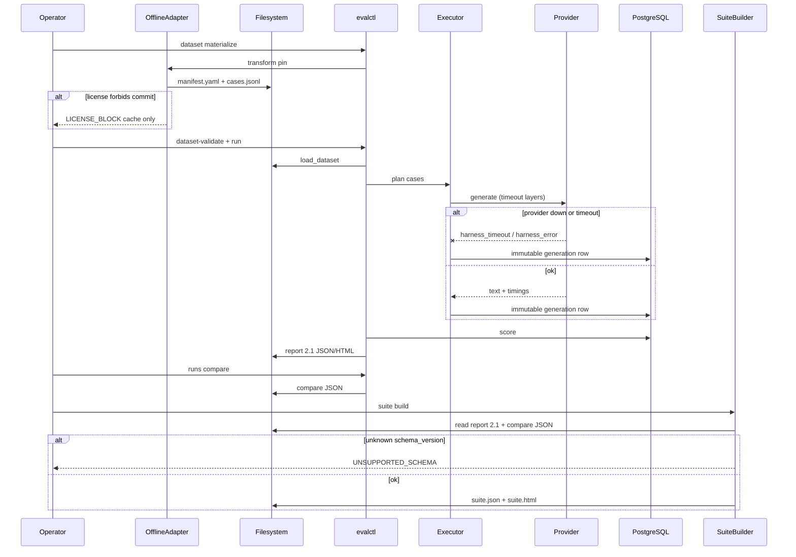
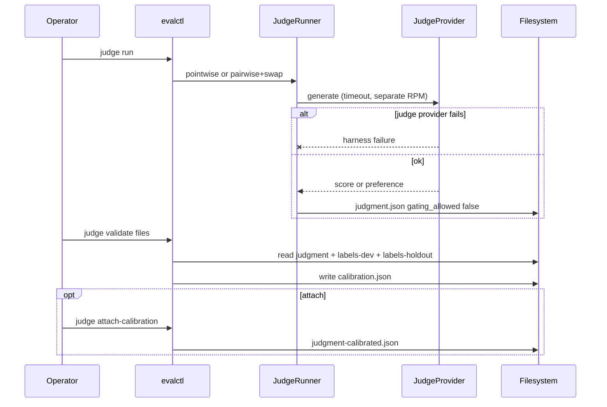
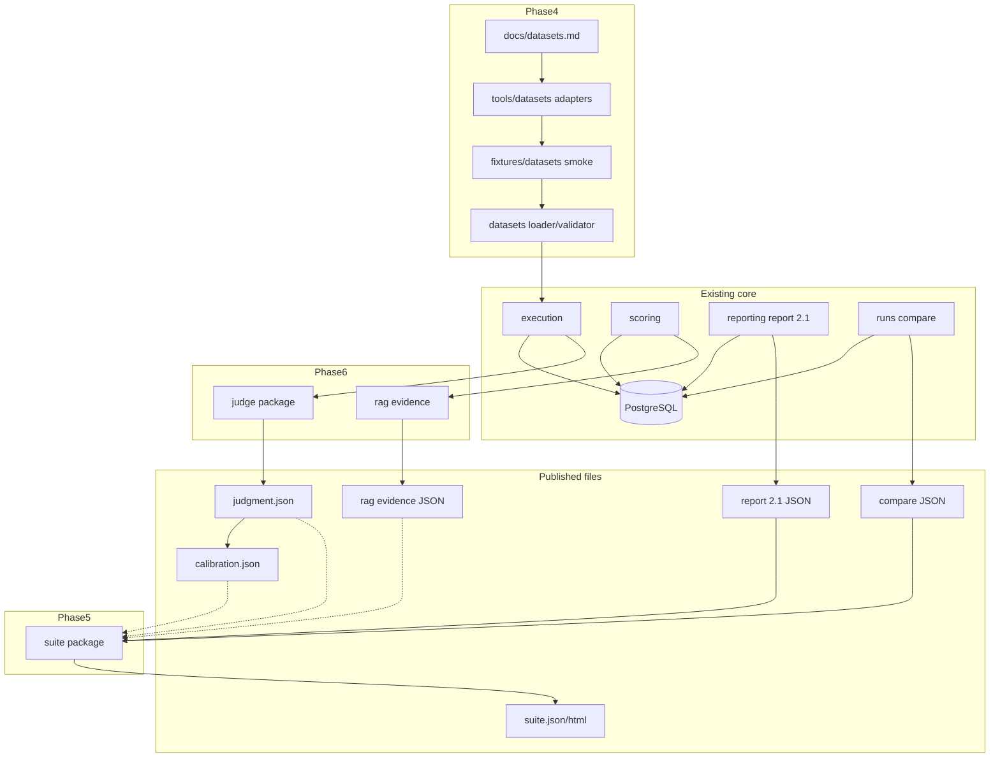

# Spec: Phases 4–6 benchmark inputs, suite visualization, judge/RAG

Status: accepted · Tier: T2 · Date: 2026-08-05  
Owner: evalanche · Reviewers: spec-reviewer findings resolved · Links: phase templates 4–6, `docs/reports.md`

## Problem

Phases 1–3 delivered a reproducible generate-once / score-many harness, a
deterministic metric catalog, paired compare JSON, and a self-contained run
report at schema **2.1**. What is still missing, in order:

1. **Real licensed inputs** so task-fit metrics and templates are exercised on
   representative data, not only synthetic QA.
2. **A multi-run benchmark view** that does not bloat or couple to the per-run
   report.
3. **Calibrated judge and RAG faithfulness signals** that cannot silently gate
   releases before **holdout** agreement thresholds clear.

Leaving these undone forces every quality claim onto tiny synthetic sets, blocks
honest cross-run leaderboards, and either skips open-ended eval or trusts an
uncalibrated judge.

## Constraints

Hard constraints that bound the design (numbers where known):

1. **License and redistribution.** Committed smoke must use SPDX ids compatible
   with this repo’s **MIT** distribution (see dataset contract allow list).
   **NC**, **DUA**, and news-fulltext packs are cache-only. MIMIC is out.
2. **No runtime Hugging Face.** `evalharness` must not depend on `datasets`,
   `huggingface_hub`, or network fetch to load cases. RAG NLI uses the Provider
   seam or stays `NLI_UNAVAILABLE`. See ADR-001.
3. **Existing dataset contract is stable.** Adapters emit today's
   `manifest.yaml` + `cases.jsonl`. Typed additive manifest fields when
   `schema_version` is set.
4. **Size tiers.** smoke 5–20 (commit if allow-listed); CI 50–200 (mock);
   nightly 500–2,000; release holdout with `--i-am-doing-a-final-eval`.
   Dev vs holdout mechanically separated.
5. **Byte reproducibility.** Same adapter version + source revision digest +
   seed ⇒ identical cases. Suite goldens byte-identical.
6. **Phase 5 isolation.** Suite reads report 2.1, compare JSON, and optional
   calibration/judge/RAG **files** only. No Postgres, providers, or rescoring.
   See ADR-002.
7. **Report 2.1 freeze.** Single-run schema and narrative unchanged.
8. **Phase 6 fail-closed.** `gating_allowed` only from holdout calibration
   artifact; judgment files stay false until attach; family separation
   mandatory for a true bit. See ADR-003.
9. **Stack** (`docs/stack.md` Absent): Python 3.12+, uv, Ruff, mypy `--strict`,
   pytest, Alembic, Postgres 16 + pgvector, Altair / vl-convert.
10. **YAGNI.** No suite server, ensembles, Phase 7 gates, or HF on default
    pytest.
11. **Published text bounds.** Truncate/redact judgment reasoning, RAG claims,
    and suite galleries per Phase 3 payload policy (see Threats + contracts).

## Current state

Grounded in this repo today:

- **Datasets:** `datasets/{loader,validator}.py`; synthetic fixtures only.
- **Templates:** `fixtures/templates/qa.jinja` only.
- **Metrics:** Full deterministic catalog; `meteor` needs NLTK data (treat as
  optional for new summarization smokes; primary `rouge_l` + `chrf_pp`).
- **Reporting:** Schema **2.1**; `EXAMPLE_TEXT_LIMIT = 280`; no `raw_response`
  in examples; `observability.sanitize_text` / `payload_summary`.
- **Compare:** CLI JSON `schema_version: "1.0"`.
- **Judge/RAG:** Tables reserved; unwired.
- **Providers:** Ollama, OpenAI-compatible, Mock.
- **CI:** ruff → mypy → alembic → PoC → pytest+cov → benchmark_100k → PoC golden.

## Approach

Three additive bounded contexts on existing seams:

```text
Phase 4 adapters → datasets
        → evalctl run / rescore → report 2.1 + compare JSON
Phase 5 suite builder → suite.json / suite.html
Phase 6 judge + RAG (strictly after Phase 5 B3; suite panels after C2–C5 stable)
        → Phase 7 gates (out of scope)
```

### Phase 4 — Real-data benchmark inputs

1. `docs/datasets.md` + typed additive manifest validation.
2. Offline adapters behind **`evalctl dataset materialize`** only; pins include
   `canonical_url` + `revision_digest`; SQuAD uses the official `dev-v1.1.json`
   URL with sha256 recorded before commit.
3. No HF packages in core or materialize path.
4. Commit smoke only after card + SPDX allow-list + attribution; else
   `.cache/datasets/`.
5. Constrained templates per task family.
6. Delivery: A1 → SQuAD → classification/extraction → A5 matrix over **present**
   smokes → A6a summarization / A6b retrieval / A7 finance-health in parallel
   under license rules.

**Initial pack:**

| Source | Task | Primary metrics | Git smoke? |
|--------|------|-----------------|------------|
| SQuAD v1.1 | `qa_short` | `squad_f1`, `exact_match` | Commit **only after** A1 card + attribution + allow-list + URL/sha256 pin |
| PubMedQA labeled (if SPDX clears) | `classification` | `classification` | Commit only if allow-listed; else cache |
| AG News fulltext | `classification` | `classification` | **Cache-only** by default |
| Financial PhraseBank | classification | — | **Cache-only** (NC); never commit |
| FiQA / FinQA | as licensed | task-fit | Commit only if allow-listed; else cache |
| CNN/DM, XSum | `summarization` | `rouge_l`, `chrf_pp` (`meteor` optional) | **Cache-only**; never commit |
| SciFact / NFCorpus | `retrieval` | `retrieval_ndcg_10` | Commit only if allow-listed |
| DocRED / license-safe extraction | `extraction` | `json_validity`, `json_field_f1` | Commit only if allow-listed |

### Phase 5 — Suite contract and visualization

Pure file package `evalharness/suite/`; `evalctl suite validate|build`.
Reuses Altair offline embed. Non-publishable members excluded from leaderboards
with reasons. Gate badges from **calibration** paths when present.

### Phase 6 — Judge and RAG

1. File-based labels with distinct `dev` / `holdout` `label_set_id`s.
2. Pointwise + pairwise swap; BT refuse rule in judge contract.
3. `evalctl judge validate` files-only → `calibration.json` (SoT for gate bit).
4. `judge attach-calibration` optional merge; judgment alone stays
   `gating_allowed: false`.
5. RAG evidence separate; NLI via Provider or `NLI_UNAVAILABLE`.
6. Strict sequence: C1–C5 start only after Phase 5 B3 is green; C6 after C2–C5
   schemas are stable.

### Flow

Materialize → run → suite build (compare artifact is a file, not a DB write for suite):



Judge validate is file-primary:



### Dependency direction (components)

Arrows show artifact/data dependency toward consumers. Compare output is a
**filesystem** artifact consumed by the suite (not Suite → Store).



## Options considered

### Option A — Monolithic benchmark module

**Cost:** couples license tooling to reporting; tempts DB access from suite.
**Fails** under isolation and HF bans.

### Option B — Phased artifact pipeline (chosen)

**Cost:** more PRs. **Fails** mainly process errors, gated by decomposition.

### Option C — Runtime HF loaders

**Fails** constraint 2 immediately.

### Decision

**Option B.** Dominating constraint: license-safe hermetic inputs and honest
artifact boundaries. Runner-up A only for an emergency single-milestone ship
that still hard-codes the same HF and file-only suite rules.

## Contract changes

See [contracts/](contracts/). CLI: `evalctl dataset materialize`,
`suite validate|build`, `judge run|validate|attach-calibration`,
`rag evidence`.

## Data changes

Phases 4–5: no Alembic required. Phase 6: prefer files first; wire existing
`judgments` / `annotations` later without blocking C4.

## Patterns

See [patterns.md](patterns.md).

## Threats

Assets: committed smoke text; cached corpora; report/suite/judgment/RAG JSON and
HTML; provider credentials; human labels; model digests.

| Threat (STRIDE) | Asset | L | I | Mitigation or acceptance | Owner |
|-----------------|-------|---|---|--------------------------|-------|
| **I** PII / sensitive text in committed smoke | Fixtures | M | H | Allow-list licenses; dataset card scrub procedure; `pii_scrubbed` + field caps; ban NC/DUA/news-fulltext from git | Phase 4 A1/A2 author |
| **I** PII in suite galleries / `case_examples` | suite.html/json | M | M | Inherit 280-char truncation; no `raw_response`; omit empty panels | Phase 5 B2/B3 |
| **I** Judge `reasoning` / RAG claim text disclosure | judgment/RAG artifacts | M | M | Truncate reasoning ≤1000, claims/spans ≤280; sanitize credential-like tokens; never embed full source docs | Phase 6 C2/C5 |
| **I** Labels with sensitive prompts in git | label fixtures | L | H | CI uses synthetic labels only; production holdout stays local/cache | Phase 6 C1 |
| **T** Tampered / unpinned source snapshot | Adapter inputs | M | H | Require `canonical_url` + `revision_digest`; refuse on mismatch; SQuAD pin recorded before commit | Phase 4 adapters |
| **T** Forged `gating_allowed` on judgment | judgment.json | M | H | Gate SoT is `calibration.json`; judgment false until attach verifies digests; suite reads calibration for badges | Phase 6 C4 |
| **T** Gate cleared on `dev` labels | calibration | M | H | Agreement for gate uses `split: holdout` only; distinct `label_set_id`; `DEV_USED_FOR_GATE` | Phase 6 C4 |
| **R** Repudiation of metric/judge config | scores/judgments | L | M | Existing content hashes + rubric/model digests on artifacts | Existing + Phase 6 |
| **S** Spoofed judge family to bypass separation | calibration | L | H | Mandatory family inequality when bit true; empty families fail closed | Phase 6 C4 |
| **D** Judge / NLI fan-out cost or hang | Providers | M | M | Existing ManagedProvider RPM/TPM/semaphore/breaker; separate judge limits; timeouts; BT/NLI offline where possible | Phase 6 + providers |
| **D** Huge corpora in materialize | Adapter/CI | L | M | Tier size caps; smoke 5–20; CI refuses unbounded `--size` without tier | Phase 4 |
| **E** Elevation via NC text under MIT repo | Legal/distribution | M | H | SPDX allow-list tied to MIT-compatible publish; NC ban; PhraseBank/CNN/XSum cache-only | Phase 4 A1 |

Accepted risks: operators with legal rights may hold cache-only NC text on disk
(owner: operator; not redistributed by this project). Synthetic CI holdout is
weaker than real human holdout (owner: Phase 7 before any real gate).

## Failure modes

| Boundary | Slow | Down | Wrong data | Half-success |
|----------|------|------|------------|--------------|
| Source pin | Fail closed | Hard error | Digest mismatch | Temp dir + atomic rename |
| Provider candidate | Existing timeouts | Harness outcomes | Wrong digest visible in suite | Immutable rows; resume |
| Provider judge/NLI | Separate timeout/RPM | No quality mutation; NLI_UNAVAILABLE | Reject bad rubric JSON | Complete judgments only; swap both-or-neither |
| Judge run inputs | N/A | Missing candidates/pairs path error | Bad JSONL / self-pair → error; missing mock key → error | Output only after all items resolve |
| RAG evidence inputs | N/A | Missing report/evidence path error | No retrieval → `QRELS_MISSING`; no NLI → `NLI_UNAVAILABLE`; no qrels/citations → section `unavailable` | Retrieval copied read-only; deferred fields explicit |
| Suite files | N/A | Missing path error | Unknown schema reject | Atomic suite write after validate |
| Validate files | N/A | Missing holdout → gate false | Dev-for-gate → error | calibration.json complete or absent |
| Attach calibration | N/A | — | Digest mismatch refuse | No in-place flip of source judgment |

## Operational readiness

### Observability

Structured logs: adapter/source/seed; suite exclusions; judge digest; rubric;
swap consistency; holdout agreement; costs. For `judge run`: judge provider/model
digest, judge/candidate families, mode, item count. For `rag evidence`: NLI
status, claim count, `unsupported_claim_rate`, context/citation section status
(`ok` / `unavailable` / `deferred`). No prompts, raw completions, candidate text,
or secrets (`payload_summary` / sanitize).

### Rollout / rollback

Additive CLI and fixtures; revert PR; delete file artifacts; append-only DB if
wired.

### Config and secrets

Existing provider settings only. Thresholds in rubric YAML.

### Capacity

Bound judge concurrency; BT on stored labels; default pytest without NLI/HF.

### Exact verification commands

```bash
uv sync --all-extras
uv run ruff check .
uv run mypy src/evalharness
uv run alembic upgrade head
uv run python scripts/run_poc.py
uv run pytest -q --cov=evalharness --cov-report=term-missing
uv run python scripts/benchmark_100k.py
git diff --exit-code -- fixtures/poc/report.json fixtures/poc/report.html fixtures/poc/meta.json
```

Phase-specific:

```bash
uv run evalctl dataset-validate fixtures/datasets/<name>-smoke
uv run evalctl dataset materialize --adapter <name> --source <pin> --out <dir> --seed 42 --size 16 --tier smoke
uv run evalctl suite validate fixtures/suite/golden/suite.yaml
uv run evalctl suite build --manifest fixtures/suite/golden/suite.yaml --output /tmp/suite-out
diff -q fixtures/suite/golden/suite.json /tmp/suite-out/suite.json
uv run evalctl judge run \
  --mode pointwise --rubric fixtures/judge/rubric.yaml \
  --candidates fixtures/judge/candidates-pointwise.jsonl \
  --provider mock --model mock-judge \
  --judge-family qwen --candidate-family llama \
  --responses fixtures/judge/mock-judge-responses.jsonl \
  --seed 42 --output /tmp/judgment.json
uv run evalctl judge validate \
  --judgments fixtures/judge/judgment.json \
  --labels-dev fixtures/judge/labels-dev.jsonl \
  --labels-holdout fixtures/judge/labels-holdout.jsonl \
  --rubric fixtures/judge/rubric-pointwise.yaml \
  --output /tmp/calibration.json
uv run evalctl rag evidence \
  --report fixtures/rag/report.json \
  --evidence fixtures/rag/evidence.jsonl \
  --nli-provider mock --nli-model mock-nli \
  --nli-responses fixtures/rag/mock-nli-responses.jsonl \
  --output /tmp/rag_evidence.json
```

`judge run` and `rag evidence` are file-primary and hermetic: with `--provider
mock` / `--nli-provider mock` they require no DB, no network, and no HF. Omitting
`--nli-provider` exercises the `NLI_UNAVAILABLE` path.

## Decomposition

See [decomposition.md](decomposition.md).

## Risks and open questions

| Risk / question | Default assumption | Owner |
|-----------------|--------------------|-------|
| PubMedQA / SciFact final SPDX | Cache until card proves allow-list | A3/A6b |
| Real human holdout before Phase 7 | Synthetic holdout for Phase 6 CI only | Phase 6 / 7 |
| NLTK for meteor | Optional; primary rouge_l + chrf_pp | A6a |
| Default κ threshold | 0.60 on **holdout** | C4 |
| SQuAD sha256 hex | Computed from official URL bytes in A1/A2 card | A2 |
